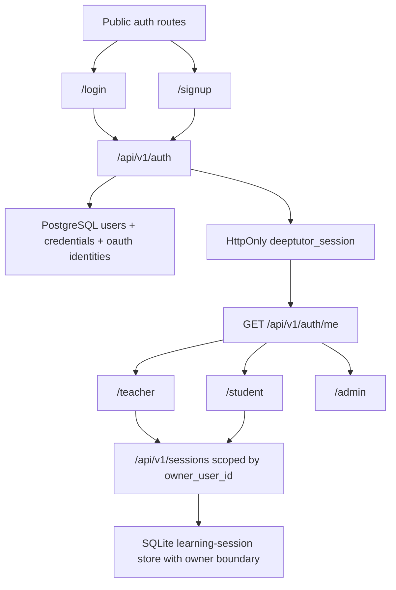

# PR Note: Auth And Multi-User Foundation

## Summary

- adds a PostgreSQL-backed auth foundation with SQLAlchemy and Alembic
- introduces backend-owned email/password login, Google OAuth entry, admin-only user listing, and opaque auth sessions
- binds learning-session list/get/rename/delete behavior to `owner_user_id`
- adds public auth routes and role-specific `/teacher`, `/student`, and `/admin` shells in the approved frontend auth scope

## Architecture

## Scope Notes

- `admin` is internal-only and blocked from public signup
- password reset and email verification pages are present, but token issuance and confirmation APIs are not implemented in this lane
- unrelated `web/**` surfaces remain outside scope because this lane only owns the decomposed auth frontend subset
