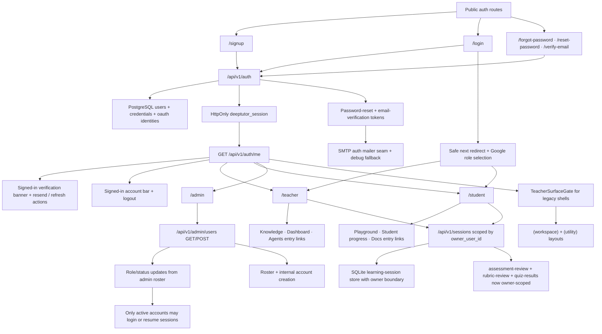

# PR Note: Auth And Multi-User Foundation

## Summary

- adds a PostgreSQL-backed auth foundation with SQLAlchemy and Alembic
- introduces backend-owned email/password login, Google OAuth entry, admin-only user listing, and opaque auth sessions
- adds internal admin account creation so `/admin` can list and create teacher/student/admin accounts
- adds password-reset and email-verification token issue/consume flows with SMTP-backed delivery when configured plus explicit debug-link fallback for local/test flows
- upgrades auth mail delivery from a best-effort toggle into an explicit policy seam with `auto`, `disabled`, and `required` modes plus provider/reply-to metadata hooks
- binds learning-session list/get/rename/delete behavior to `owner_user_id`
- enforces session ownership on assessment review, rubric review, and quiz-result write endpoints so review flows no longer bypass the auth boundary
- makes the auth session cookie production-configurable for `secure`, `samesite`, and `max-age` instead of hardcoding demo defaults
- preserves safe `next` redirects across login/signup and Google auth entry so protected teacher surfaces now bounce users back to the route they originally requested
- surfaces non-blocking email-verification banners across signed-in shells and teacher-first legacy surfaces, with resend and refresh-status actions instead of leaving verification hidden behind a standalone route
- adds a shared signed-in account bar so teacher, student, admin, and legacy teacher-first shells always expose current identity, role, verification state, and logout
- upgrades the admin roster from create-only to lifecycle management, including role/status edits, while auth entry points now reject suspended accounts across email-password, session reuse, and Google callback
- adds public auth routes, recovery/verification pages, and role-specific `/teacher`, `/student`, and `/admin` shells in the approved frontend auth scope
- upgrades `/teacher` and `/student` from placeholder shells into role hubs that link into the current teacher-first and student-facing routes
- gates the legacy teacher-first `(workspace)` and `(utility)` shells behind authenticated teacher/admin access

## Architecture

## Scope Notes

- `admin` is internal-only and blocked from public signup
- password reset and email verification now issue and consume real backend tokens
- delivery now uses SMTP when `DEEPTUTOR_AUTH_SMTP_*` and `DEEPTUTOR_AUTH_FROM_*` are configured, with debug-link fallback preserved for local/test environments
- signed-in verification resend now fails loudly with `503` in `required` mail-delivery mode when production email transport is missing or broken, while forgot-password keeps a privacy-safe generic response
- assessment review write/read flows now require the authenticated owner instead of only the session id
- unrelated `web/**` surfaces remain outside scope because this lane only owns the decomposed auth frontend subset
