# PR Note: Auth And Multi-User Foundation

## Summary

- adds a PostgreSQL-backed auth foundation with SQLAlchemy and Alembic
- introduces backend-owned email/password login, Google OAuth entry, admin-only user listing, and opaque auth sessions
- adds internal admin account creation so `/admin` can list and create teacher/student/admin accounts
- adds password-reset and email-verification token issue/consume flows with SMTP-backed delivery when configured plus explicit debug-link fallback for local/test flows
- upgrades auth mail delivery from a best-effort toggle into an explicit policy seam with `auto`, `disabled`, and `required` modes plus provider/reply-to metadata hooks
- binds learning-session list/get/rename/delete behavior to `owner_user_id`
- enforces session ownership on assessment review, rubric review, and quiz-result write endpoints so review flows no longer bypass the auth boundary
- makes the auth session cookie production-configurable for `secure`, `samesite`, and `max-age` instead of hardcoding demo defaults
- preserves safe `next` redirects across login/signup and Google auth entry so protected teacher surfaces now bounce users back to the route they originally requested
- surfaces non-blocking email-verification banners across signed-in shells and teacher-first legacy surfaces, with resend and refresh-status actions instead of leaving verification hidden behind a standalone route
- adds a shared signed-in account bar so teacher, student, admin, and legacy teacher-first shells always expose current identity, role, verification state, and logout
- upgrades the admin roster from create-only to lifecycle management, including role/status edits, while auth entry points now reject suspended accounts across email-password, session reuse, and Google callback
- adds public auth routes, recovery/verification pages, and role-specific `/teacher`, `/student`, and `/admin` shells in the approved frontend auth scope
- upgrades `/teacher` and `/student` from placeholder shells into role hubs that link into the current teacher-first and student-facing routes
- gates the legacy teacher-first `(workspace)` and `(utility)` shells behind authenticated teacher/admin access
- extends that teacher/admin gate into backend teacher-first routers: `dashboard`, `knowledge`, `marketplace`, and `assessment`
- scopes dashboard evidence rows by `owner_user_id` so teacher actions, acknowledgements, feedback, overrides, and intervention assignments no longer bleed across accounts
- rebuilds dashboard observation/state persistence onto owner-aware composite keys so repeated `student_id` and `observation_id` values no longer collide across teachers inside the SQLite learning-session store
- propagates that owner scope into tutoring turn runtime and context building, so live tutoring observations and retrieved student-state context no longer regress back to anonymous storage after authentication
- moves lightweight `SUMMARY.md` / `PROFILE.md` memory into owner-specific storage, auth-gates `/api/v1/memory`, and binds runtime memory context/refresh writes to the authenticated actor instead of a global shared file pair
- hardens the legacy `/api/v1/chat*` and `/api/v1/solve*` transports by requiring authenticated cookies on REST + websocket entrypoints and filtering their JSON session stores by `owner_user_id`
- auth-gates the legacy guided-learning `/api/v1/guide*` REST + websocket surface and binds guided-learning session files to `owner_user_id`
- auth-gates `/api/v1/tutorbot*`, persists bot owner metadata, filters teacher access to owned bots/workspaces/history/websockets, and keeps admin override for internal support
- makes knowledge-pack default selection user-specific and stamps newly created/imported knowledge packs with auth-era ownership metadata
- changes marketplace imports to create per-user imported copies, preventing two teachers from colliding on the same imported pack name

## Architecture

```mermaid
flowchart TD
  Public["Public auth routes"] --> Signup["/signup"]
  Public --> Login["/login"]
  Public --> Recovery["/forgot-password · /reset-password · /verify-email"]
  Login --> AuthAPI["/api/v1/auth"]
  Signup --> AuthAPI
  Recovery --> AuthAPI
  Login --> NextRedirect["Safe next redirect + Google role selection"]
  Me --> VerificationBanner["Signed-in verification banner + resend / refresh actions"]
  Me --> AccountBar["Signed-in account bar + logout"]
  AdminUsersAPI --> AccountLifecycle["Role/status updates from admin roster"]
  AuthAPI --> Users["PostgreSQL users + credentials + oauth identities"]
  AuthAPI --> Sessions["HttpOnly deeptutor_session"]
  AuthAPI --> OneTimeTokens["Password-reset + email-verification tokens"]
  OneTimeTokens --> AuthMailer["SMTP auth mailer seam + debug fallback"]
  AdminShell --> AdminUsersAPI["/api/v1/admin/users GET/POST"]
  AdminUsersAPI --> AdminPanel["Roster + internal account creation"]
  Sessions --> Me["GET /api/v1/auth/me"]
  Me --> TeacherShell["/teacher"]
  Me --> StudentShell["/student"]
  Me --> AdminShell["/admin"]
  NextRedirect --> TeacherShell
  NextRedirect --> StudentShell
  TeacherShell --> TeacherHub["Knowledge · Dashboard · Agents entry links"]
  StudentShell --> StudentHub["Playground · Student progress · Docs entry links"]
  Me --> TeacherGate["TeacherSurfaceGate for legacy shells"]
  TeacherGate --> LegacyShells["(workspace) + (utility) layouts"]
  TeacherShell --> OwnedSessionAPI["/api/v1/sessions scoped by owner_user_id"]
  StudentShell --> OwnedSessionAPI
  OwnedSessionAPI --> SQLiteStore["SQLite learning-session store with owner boundary"]
  SQLiteStore --> ScopedSignals["observations + student_states keyed by owner_user_id"]
  OwnedSessionAPI --> TurnRuntime["Turn runtime + context builder use owner-scoped tutoring signals"]
  OwnedSessionAPI --> ReviewFlows["assessment-review + rubric-review + quiz-results now owner-scoped"]
  TeacherShell --> TeacherFirstAPIs["/api/v1/dashboard · /api/v1/knowledge · /api/v1/marketplace require teacher/admin"]
  TeacherFirstAPIs --> DashboardEvidence["teacher_actions · recommendation_* · diagnosis_feedback · intervention_assignments owner-scoped"]
  TeacherFirstAPIs --> ScopedSignals
  TeacherFirstAPIs --> KnowledgeDefaults["user-specific knowledge default + KB ownership metadata"]
  TeacherFirstAPIs --> MarketplaceImports["per-user imported pack copies"]
  TeacherFirstAPIs --> AssessmentScope["assessment recommend + diagnosis owner-scoped"]
  Me --> MemoryAPI["/api/v1/memory auth-gated per user"]
  MemoryAPI --> MemoryFiles["users/<owner>/SUMMARY.md + PROFILE.md"]
  TurnRuntime --> MemoryFiles
  Public --> LegacyChatSolve["Legacy /chat and /solve routes"]
  LegacyChatSolve --> LegacySessionJSON["JSON session stores with owner_user_id"]
  LegacySessionJSON --> AuthBoundary["Auth cookie required for REST + WS access"]
  TeacherShell --> GuideSurface["/api/v1/guide REST + WS"]
  GuideSurface --> GuideSessions["guided session JSON with owner_user_id"]
  TeacherShell --> TutorBotSurface["/api/v1/tutorbot"]
  TutorBotSurface --> TutorBotConfigs["teacher-owned bot configs + workspace/history access"]
  TutorBotSurface --> AdminOverride["admin override for tutorbot support"]
  AccountLifecycle --> ActiveOnlyAuth["Only active accounts may login or resume sessions"]
```

## Scope Notes

- `admin` is internal-only and blocked from public signup
- password reset and email verification now issue and consume real backend tokens
- delivery now uses SMTP when `DEEPTUTOR_AUTH_SMTP_*` and `DEEPTUTOR_AUTH_FROM_*` are configured, with debug-link fallback preserved for local/test environments
- signed-in verification resend now fails loudly with `503` in `required` mail-delivery mode when production email transport is missing or broken, while forgot-password keeps a privacy-safe generic response
- assessment review write/read flows now require the authenticated owner instead of only the session id
- dashboard analytics and teacher-evidence mutations are now teacher-owner scoped for non-admin users
- dashboard observation rollups and persisted student-state snapshots are now teacher-owner scoped as well, so two teachers can reuse the same `student_id` without sharing diagnosis residue
- live tutoring turns now persist observations and retrieve student-state context under the owning session account, not the legacy anonymous bucket
- lightweight memory reads, writes, clears, and refreshes are now per-user, and runtime memory injection uses the authenticated actor id even when an admin is viewing a globally scoped session
- legacy `/api/v1/chat*` and `/api/v1/solve*` routes now require authentication and filter their JSON-backed session CRUD + websocket resume flows by `owner_user_id`
- legacy `/api/v1/guide*` routes now require authentication, and guide session create/get/list/chat/page/reset/delete flows resolve only owned guided-learning sessions for normal teachers while admins retain cross-session visibility
- legacy `/api/v1/tutorbot*` routes now require authenticated `teacher` or `admin` access, and newly created bots persist owner metadata so non-admin teachers can only see and connect to their own bots, bot files, and history
- assessment recommendation and diagnosis now use the same teacher/admin gate and owner-scoped signal store, so support-heavy diagnosis cannot be influenced by another teacher's sessions or tutoring evidence
- `GET/PUT /api/v1/knowledge/default` is now per-user instead of global, and newly created/imported auth-era packs record `owner_user_id`, `owner_email`, and `owner_display_name`
- unrelated `web/**` surfaces remain outside scope because this lane only owns the decomposed auth frontend subset
