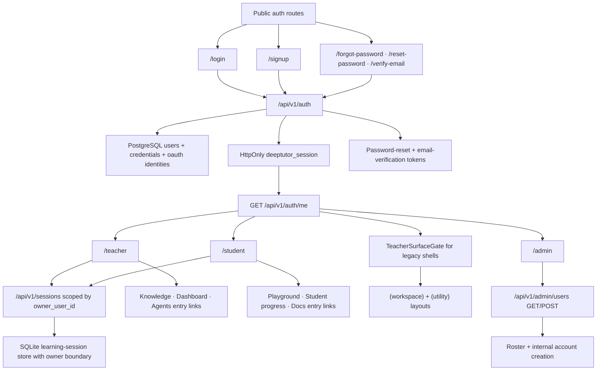

# PR Note: Auth And Multi-User Foundation

## Summary

- adds a PostgreSQL-backed auth foundation with SQLAlchemy and Alembic
- introduces backend-owned email/password login, Google OAuth entry, admin-only user listing, and opaque auth sessions
- adds internal admin account creation so `/admin` can list and create teacher/student/admin accounts
- adds password-reset and email-verification token issue/consume flows with local debug-link delivery seams
- binds learning-session list/get/rename/delete behavior to `owner_user_id`
- adds public auth routes, recovery/verification pages, and role-specific `/teacher`, `/student`, and `/admin` shells in the approved frontend auth scope
- upgrades `/teacher` and `/student` from placeholder shells into role hubs that link into the current teacher-first and student-facing routes
- gates the legacy teacher-first `(workspace)` and `(utility)` shells behind authenticated teacher/admin access

## Architecture

## Scope Notes

- `admin` is internal-only and blocked from public signup
- password reset and email verification now issue and consume real backend tokens
- delivery is still local/debug only; the lane does not yet integrate a production mail provider
- unrelated `web/**` surfaces remain outside scope because this lane only owns the decomposed auth frontend subset
