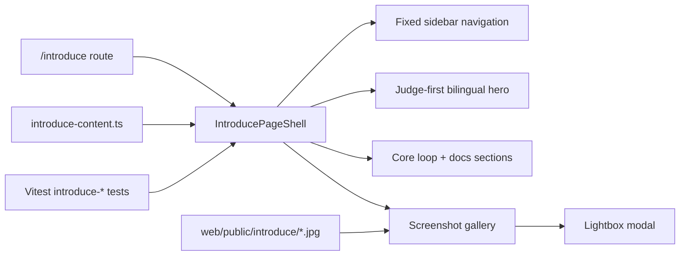

# PR Note: UI Public Introduce Docs Page

## Summary

- add a standalone public `/introduce` route outside the internal workspace shells
- present a judge-first bilingual docs page with fixed sidebar navigation, real product screenshots, and a route-local content model
- provide educator and technical documentation entry sections plus a resource bridge into the contest package
- cover the new surface with focused Vitest checks for content integrity, page structure, and gallery lightbox behavior

## Mermaid

## Main System Map

- Updated. The project now exposes a standalone public docs route at `/introduce` with its own navigation and screenshot evidence surface.
