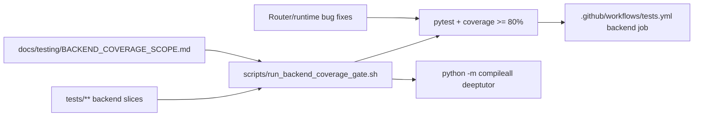

# PR Note: T052 Backend Coverage Gate

## Summary

- add one authoritative backend gate script and point CI at the same command
- document the audited backend denominator and the temporary omit list for non-product-path modules
- expand backend regression coverage around API lifecycle, knowledge/question routers, unified WebSocket handling, and session turn-runtime helpers
- fix two backend behaviors uncovered during truthful test authoring instead of encoding them as false expectations

## Mermaid

## Main System Map

- Not updated. This task changes backend quality enforcement and regression coverage, but it does not change the supported product-path architecture itself.
