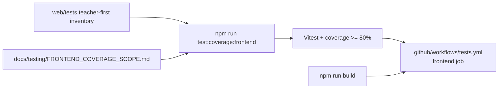

# PR Note: T053 Frontend Coverage Gate

## Summary

- add one authoritative frontend coverage command based on Vitest and point CI at that same command
- document the teacher-first in-scope frontend denominator and the temporary omit list for dormant or composition-heavy frontend surfaces
- migrate the audited frontend test inventory from `node:test` to a real coverage-producing runner
- keep `next build` as a separate required frontend validation step instead of pretending build-only checks satisfy behavioral coverage

## Mermaid

## Main System Map

- Not updated. This task changes frontend quality enforcement and the documented coverage denominator, but it does not change the supported teacher-first product-path architecture itself.
