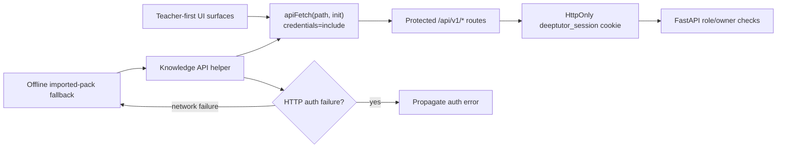

# PR Note: Frontend Auth Cookie Hardening

## Summary

- Added a shared `apiFetch(...)` helper that defaults protected internal API calls to `credentials: "include"`.
- Migrated protected teacher-first frontend surfaces from raw `fetch(apiUrl(...))` calls to the shared helper across Knowledge, Dashboard, Marketplace, Notebook, Agent Spec, Guide, Tutorbot/Agents, Co-writer, and Playground.
- Hardened Knowledge API fallback behavior so real `401` auth failures are no longer masked as empty/offline state.
- Added regression tests to guard the helper contract and prevent raw protected fetches from quietly returning.

## Architecture Note

## Verification

- `node node_modules/vitest/vitest.mjs run tests/api-base-url.test.ts tests/knowledge-api-auth.test.ts tests/protected-api-fetches-source.test.ts`
- `cd web && npm run build`
- `cd web && npm run test:coverage:frontend`
- `git diff --check`
