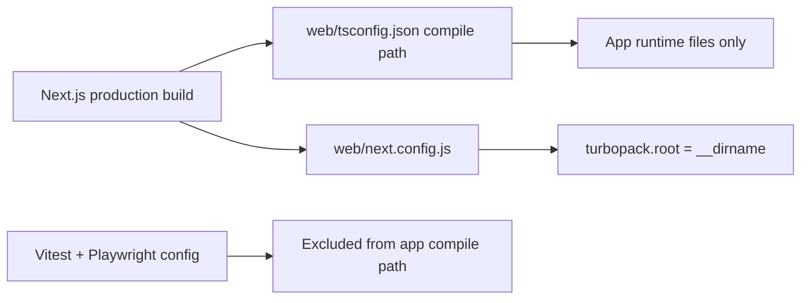

# PR Note: L1 Build Hygiene Productization

## Summary

- exclude Vitest, Playwright, and `tests/**` from the app TypeScript compile path
- add a regression test that locks the compile-boundary contract
- pin `turbopack.root` to the web workspace so `next build` stops inferring the parent home directory as the workspace root

## Validation

- `cd web && node node_modules/vitest/vitest.mjs run tests/build-config-hygiene.test.ts tests/api-base-url.test.ts`
- `cd web && npm run build`
- `git diff --check`

## Build Hygiene Flow

