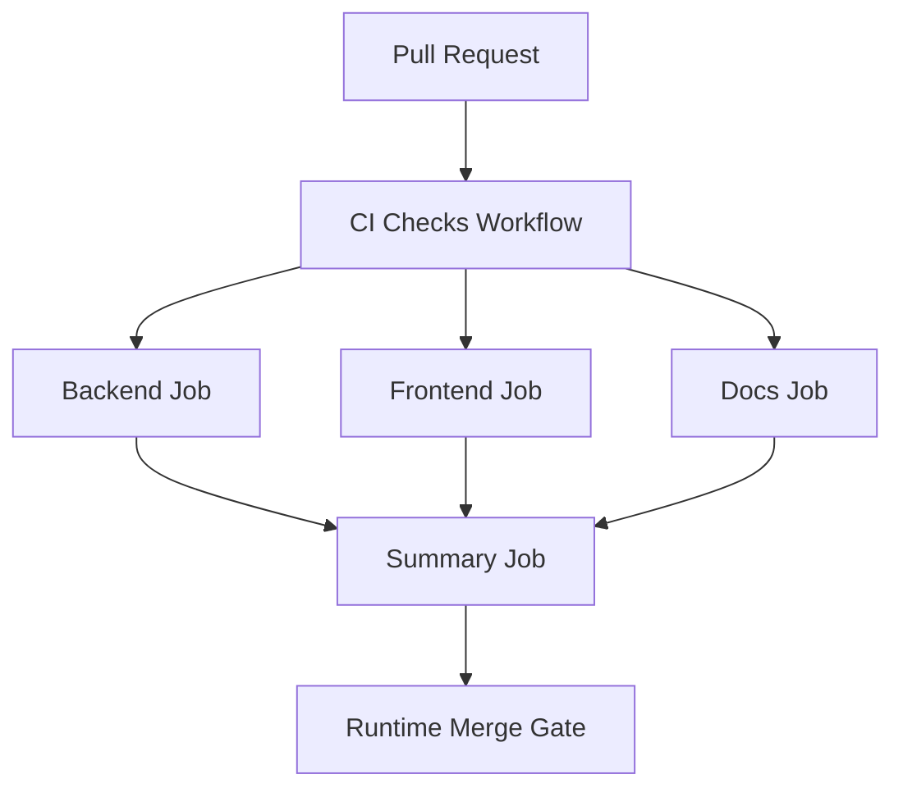

# PR Architecture Note: Backend and Frontend CI Checks

## Summary

Adds a single GitHub Actions workflow that runs backend tests, frontend build validation, and docs checks on pull requests and pushes to `main`.

## Scope

- `.github/workflows/tests.yml`
- `docs/superpowers/pr-notes/ci-backend-frontend-checks.md`
- AI-first status mirror updates

## Mermaid Diagram



## Architecture Impact

No product architecture changes. This PR adds repository-level merge gate automation through GitHub Actions.

## Data/API Changes

None.

## Tests

```bash
pytest tests/api/test_knowledge_router.py -v
pytest tests/knowledge -v
pytest tests/api/test_question_router.py -v
pytest tests/api/test_unified_ws_turn_runtime.py -v
pytest tests/api/test_dashboard_router.py -v
pytest tests/services/session -v
python3 -m compileall deeptutor
cd web && NEXT_PUBLIC_API_BASE=http://localhost:8001 npm run build
rg -n "backend|frontend|pytest|npm run build|NEXT_PUBLIC_API_BASE|Mermaid" .github/workflows docs/superpowers/pr-notes ai_first
git diff --check
```

## Main System Map Update

- [x] Not needed, because this PR changes CI workflow policy rather than product architecture.
- [ ] Updated `ai_first/architecture/MAIN_SYSTEM_MAP.md`
