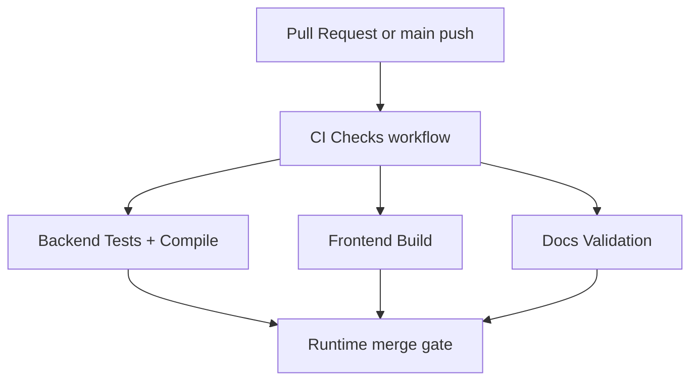

# PR Architecture Note: Backend and Frontend CI Checks

## Summary

Replaces the legacy Python-only smoke workflow with a single CI workflow that runs backend validation, frontend production build, and docs policy checks on pull requests and pushes to `main`.

## Scope

- Updates `.github/workflows/tests.yml` to define the authoritative CI checks.
- Keeps the change inside workflow/docs/AI-first ownership boundaries.
- Leaves runtime and product code unchanged.

## Mermaid Diagram



## Architecture Impact

No product/runtime architecture change. This PR adds merge-gating workflow automation only.

## Data/API Changes

None.

## Tests

```bash
python3 - <<'PY'
import pathlib, yaml
yaml.safe_load(pathlib.Path(".github/workflows/tests.yml").read_text())
print("workflow-parse-ok")
PY
rg -n "backend|frontend|pytest|npm run build|NEXT_PUBLIC_API_BASE|Mermaid" .github/workflows docs/superpowers/pr-notes ai_first
git diff --check
```

## Main System Map Update

- [x] Not needed, because this PR changes CI workflow automation rather than shared runtime architecture.
- [ ] Updated `ai_first/architecture/MAIN_SYSTEM_MAP.md`
