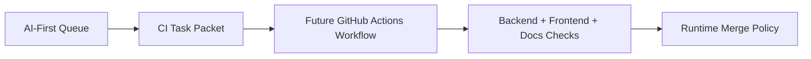

# PR Architecture Note: Backend and Frontend CI Task Packet

## Summary

Adds the task packet for implementing reliable backend, frontend, and docs CI checks before broader runtime auto-merge.

## Scope

- Creates `docs/superpowers/tasks/2026-04-19-ci-backend-frontend.md`.
- Updates AI-first status mirrors so the autonomous queue moves to CI implementation.

## Mermaid Diagram



## Architecture Impact

No runtime architecture changes. This PR only creates the CI implementation task packet.

## Data/API Changes

None.

## Tests

```bash
rg -n "backend|frontend|pytest|npm run build|NEXT_PUBLIC_API_BASE|Mermaid" docs/superpowers/tasks/2026-04-19-ci-backend-frontend.md docs/superpowers/pr-notes/ci-backend-frontend-packet.md ai_first
git diff --check
```

## Main System Map Update

- [x] Not needed, because this is a docs-only task packet and does not add the CI workflow yet.
- [ ] Updated `ai_first/architecture/MAIN_SYSTEM_MAP.md`
