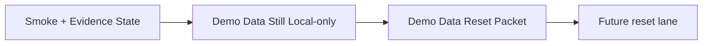

# PR Note: Contest Demo Data Reset Packet

## Summary

This PR queues the next short docs/workflow lane for making contest demo data reproducible after the smoke and evidence-refresh work.

## Mermaid Diagram

## Architecture Impact

`ai_first/architecture/MAIN_SYSTEM_MAP.md` is not updated. This PR adds docs/workflow guidance for the next queue step without changing product/runtime architecture.
