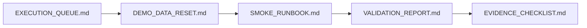

# PR Note: Contest Demo Data Reset Runbook

## Summary

This PR implements the demo data reset lane by adding a compact `docs/contest/DEMO_DATA_RESET.md` runbook and linking it into the existing contest evidence and smoke workflow.

## Mermaid Diagram



## Architecture Impact

`ai_first/architecture/MAIN_SYSTEM_MAP.md` is not updated. This PR adds docs/workflow guidance for reproducible local demo state and does not change product/runtime architecture.

## Validation

```bash
rg -n "demo data|reset|smoke|evidence|Mermaid|Knowledge Pack|contest" docs/superpowers/tasks docs/superpowers/pr-notes ai_first docs/contest
git diff --check
```

## Handoff Notes

- Use `DEMO_DATA_RESET.md` before smoke when local data may be missing, stale, or private.
- A future runtime lane may automate the reset after the manual contract is proven useful.
