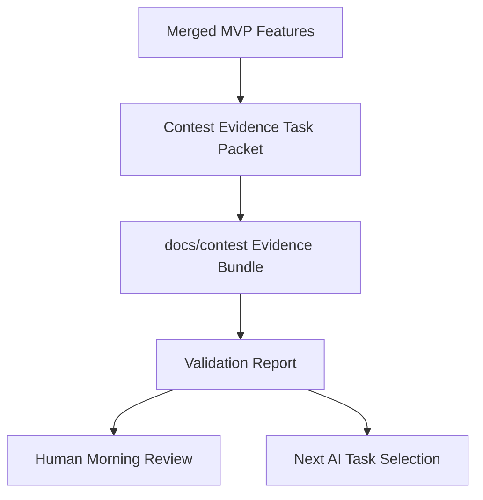

# PR Architecture Note: Contest Evidence and Demo Packet

## Summary

Adds a docs-only task packet for preparing the contest evidence bundle and demo readiness materials.

## Scope

- Defines the next evidence/demo task.
- Captures owned files and do-not-touch boundaries.
- Defines acceptance criteria and validation commands for the future evidence bundle.
- Updates AI-first status mirrors so the autonomous loop continues from this packet.

## Mermaid Diagram



## Architecture Impact

No runtime architecture changes. This PR only creates the execution packet for evidence and demo documentation.

## Data/API Changes

None.

## Tests

```bash
rg -n "Knowledge Pack|assessment|Tutor|Dashboard|Mermaid|validation|screenshot|video" docs/superpowers/tasks/2026-04-19-contest-evidence-demo.md docs/superpowers/pr-notes/contest-evidence-demo-packet.md
git diff --check
```

## Main System Map Update

- [x] Not needed, because this is a docs-only task packet and does not change product architecture.
- [ ] Updated `ai_first/architecture/MAIN_SYSTEM_MAP.md`
