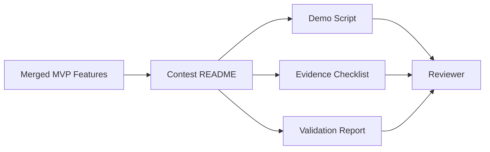

# PR Architecture Note: Contest Evidence Demo Bundle

## Summary

Adds the contest evidence bundle entry point, demo script, evidence checklist, and validation report for the current MVP path.

## Scope

- `docs/contest/README.md`
- `docs/contest/DEMO_SCRIPT.md`
- `docs/contest/EVIDENCE_CHECKLIST.md`
- `docs/contest/VALIDATION_REPORT.md`
- AI-first status mirror updates

## Mermaid Diagram



## Architecture Impact

No runtime architecture changes. This PR adds documentation evidence for the existing MVP path.

## Data/API Changes

None.

## Tests

```bash
rg -n "Knowledge Pack|assessment|Tutor|Dashboard|Mermaid|validation|screenshot|video" docs/contest docs/superpowers/pr-notes
git diff --check
```

## Main System Map Update

- [x] Not needed, because this is a docs-only evidence bundle and does not change product architecture.
- [ ] Updated `ai_first/architecture/MAIN_SYSTEM_MAP.md`
