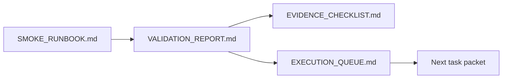

# PR Note: Contest Evidence Refresh Execution

## Summary

- refreshes `docs/contest/` so smoke-backed evidence status is explicit;
- separates auto-refreshed smoke evidence from human-capture screenshots and optional video;
- updates AI-first queue mirrors so the next lane must be derived from the MVP goal after this merge.

## Architecture Impact

- `ai_first/architecture/MAIN_SYSTEM_MAP.md` does not need an update.
- Reason: this PR changes docs/workflow guidance only and does not alter product/runtime architecture.

## Evidence Refresh Flow

