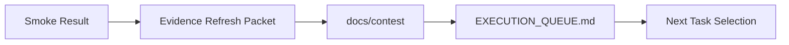

# PR Architecture Note: Contest Evidence Refresh Packet

## Summary

This PR adds a docs/workflow task packet for refreshing contest evidence after smoke runs so the evidence bundle stays aligned with the current MVP path.

## Mermaid Diagram

## Main System Map Update

`ai_first/architecture/MAIN_SYSTEM_MAP.md` is not updated. This PR adds docs/workflow guidance for evidence refresh without changing product/runtime architecture.
