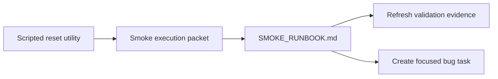

# PR Note: Contest Smoke Scripted Reset Packet

## Summary

This PR queues the next short execution lane: run the contest smoke path after executing the scripted local demo data reset utility merged in PR `#36`.

## Mermaid Diagram



## Architecture Impact

`ai_first/architecture/MAIN_SYSTEM_MAP.md` is not updated. This PR adds a docs/workflow task packet and queue sync, not product/runtime architecture.

## Validation

```bash
rg -n "scripted|reset|smoke|evidence|Knowledge Pack|contest|Mermaid" docs/contest docs/superpowers/tasks docs/superpowers/pr-notes ai_first
git diff --check
```

## Handoff Notes

- Next branch: `docs/contest-smoke-scripted-reset`.
- Start by running `python3 -m scripts.contest.reset_demo_data --project-root . --api-base http://localhost:8001`.
- Keep generated local `data/` changes out of commits.
