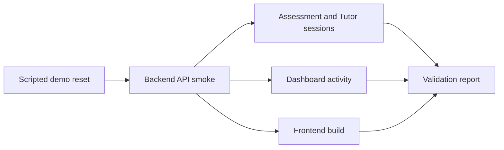

# PR Note: Contest Smoke Scripted Reset Execution

## Summary

This PR records the contest smoke run after executing the scripted local demo reset utility. The smoke run refreshed command evidence for the demo-safe Knowledge Pack, assessment session, tutor session, dashboard activity, and frontend production build.

## Mermaid Diagram



## Architecture Impact

`ai_first/architecture/MAIN_SYSTEM_MAP.md` is not updated. This PR records smoke/evidence execution only and does not change product/runtime architecture.

## Validation

```bash
python3 -m scripts.contest.reset_demo_data --project-root . --api-base http://localhost:8001
curl -s http://127.0.0.1:8001/api/v1/system/status
curl -s http://127.0.0.1:8001/api/v1/knowledge/list
curl -s http://127.0.0.1:8001/api/v1/dashboard/overview
curl -s http://127.0.0.1:8001/api/v1/dashboard/recent
curl -s http://127.0.0.1:8001/api/v1/sessions/contest-assessment-demo
curl -s http://127.0.0.1:8001/api/v1/sessions/contest-tutor-demo
cd web && npm run build
rg -n "scripted|reset|smoke|evidence|Knowledge Pack|contest|Mermaid|Current|Passed" docs/contest docs/superpowers/tasks docs/superpowers/pr-notes ai_first
git diff --check
```

## Handoff Notes

- Backend smoke used `/Users/nguyenhuuloc/Documents/Multiagent-learning-platform/.venv/bin/python -m deeptutor_cli.main serve --host 127.0.0.1 --port 8001`.
- `.venv/bin/python -m deeptutor.api.run_server` still fails with the installed `uvicorn` because reload excludes are absolute patterns.
- The first frontend build failed without network access while fetching Google Fonts; the same build passed with network permission.
