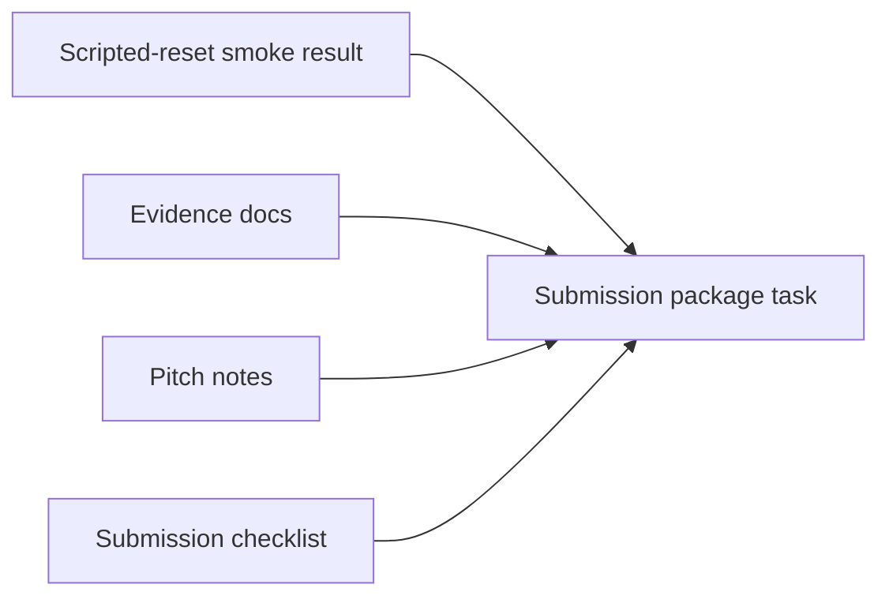

# PR Note: Contest Submission Package Packet

## Summary

This PR queues the next short contest documentation lane: prepare a compact submission package that links the MVP story, pitch, smoke-backed evidence, screenshots, known limitations, and final checklist.

## Mermaid Diagram



## Architecture Impact

`ai_first/architecture/MAIN_SYSTEM_MAP.md` is not updated. This PR queues a docs/workflow packaging task and does not change product/runtime architecture.

## Validation

```bash
rg -n "submission|package|pitch|evidence|smoke|screenshot|video|Mermaid|contest" docs/contest ai_first/competition docs/superpowers/tasks docs/superpowers/pr-notes ai_first
git diff --check
```

## Handoff Notes

- Next branch: `docs/contest-submission-package`.
- Keep the final package short and link-heavy.
- Do not add large video files or generated local data.
