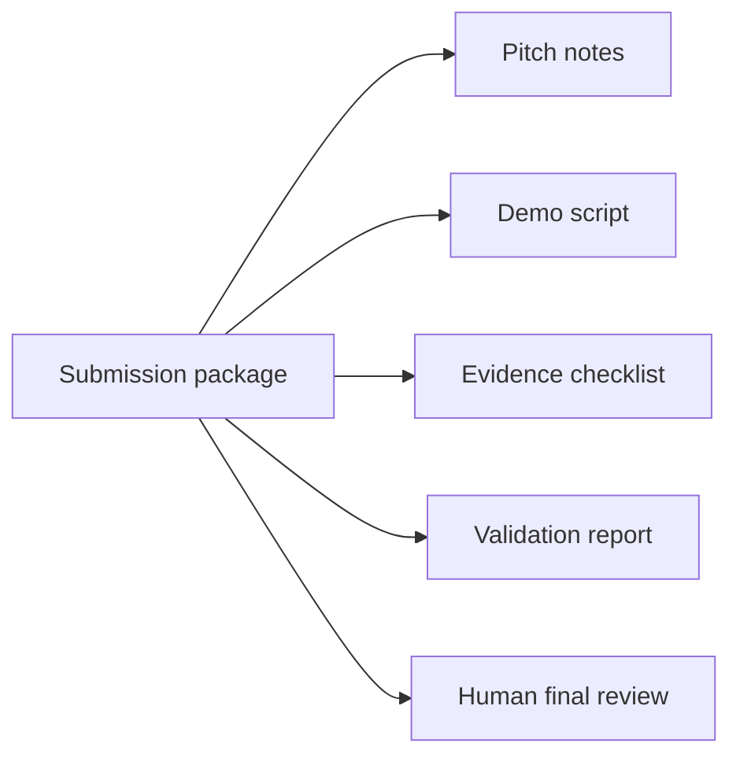

# PR Note: Contest Submission Package

## Summary

This PR adds a compact contest submission package that links the MVP pitch, demo story, smoke-backed validation, evidence checklist, screenshots, known limitations, and final submission checklist.

## Mermaid Diagram



## Architecture Impact

`ai_first/architecture/MAIN_SYSTEM_MAP.md` is not updated. This PR packages contest documentation and does not change product/runtime architecture.

## Validation

```bash
rg -n "submission|package|pitch|evidence|smoke|screenshot|video|Mermaid|contest" docs/contest ai_first/competition docs/superpowers/tasks docs/superpowers/pr-notes ai_first
git diff --check
```

## Handoff Notes

- Human review is still needed for IP commitment, final product description wording, and whether optional video is required.
- Do not store large video files in the repository.
