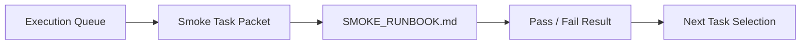

# PR Architecture Note: Demo Readiness Smoke Packet

## Summary

This PR adds the first docs-first smoke lane packet and runbook for the contest MVP path.

## Mermaid Diagram

## Main System Map Update

`ai_first/architecture/MAIN_SYSTEM_MAP.md` is not updated. This PR adds docs/workflow guidance for smoke validation without changing product/runtime architecture.
