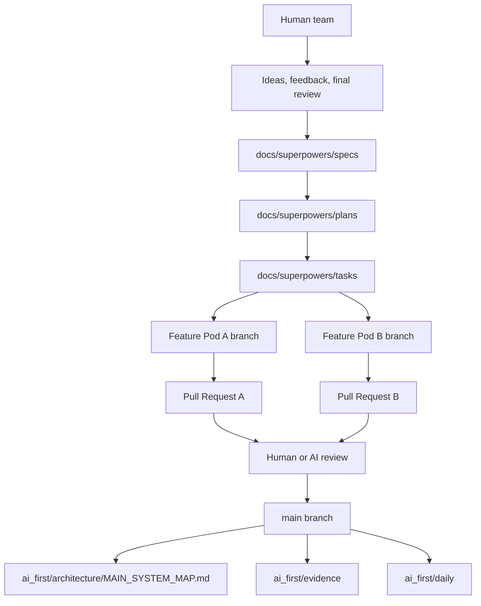

# PR Architecture Note: AI-first Project OS

## Summary

Adds the repository operating layer for AI-first development: injected AI instructions, project memory files, architecture maps, task templates, competition evidence skeleton, and PR documentation rules.

## Scope

Documentation and workflow only. No runtime backend or frontend behavior changes.

## Mermaid Diagram



## Architecture Impact

Creates an explicit operating layer around the existing DeepTutor architecture. The runtime remains unchanged.

## Data/API Changes

No application data or API changes.

## Tests

Documentation verification:

```bash
rg -n "```mermaid|MAIN_SYSTEM_MAP|AI_OPERATING_PROMPT|Feature Pod" ai_first docs/superpowers .github
```

## Main System Map Update

- [ ] Not needed, because:
- [x] Updated `ai_first/architecture/MAIN_SYSTEM_MAP.md`
