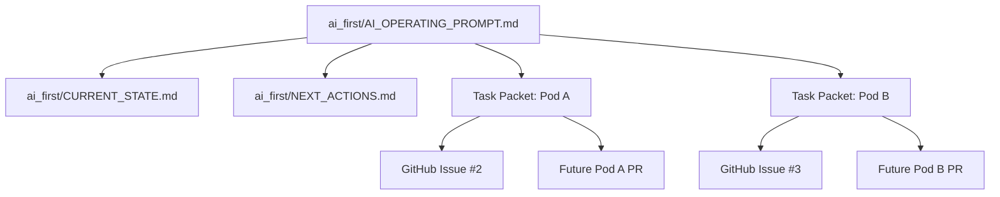

# PR Architecture Note: First Feature Pod Task Packets

## Summary

Adds the first execution task packets for Pod A and Pod B, updates the AI-first status mirrors after Milestone 0 merged, and links the task packets to GitHub issues `#2` and `#3`.

## Scope

Documentation and workflow only. No backend or frontend runtime behavior changes.

## Mermaid Diagram


```

## Architecture Impact

Moves the repository from general AI-first operating rules into concrete execution packets. The operating layer now has explicit Pod A and Pod B work definitions tied to GitHub issues.

## Data/API Changes

No runtime data model or API changes. This PR only defines planned contracts for future implementation work.

## Tests

Documentation-only verification:

```bash
gh issue list --limit 10 --state open
rg -n '#2|#3|GitHub Issue:' ai_first docs/superpowers/tasks
```

## Main System Map Update

- [ ] Not needed, because: this PR only creates task packets and status mirrors; it does not change the system structure itself.
- [ ] Updated `ai_first/architecture/MAIN_SYSTEM_MAP.md`
