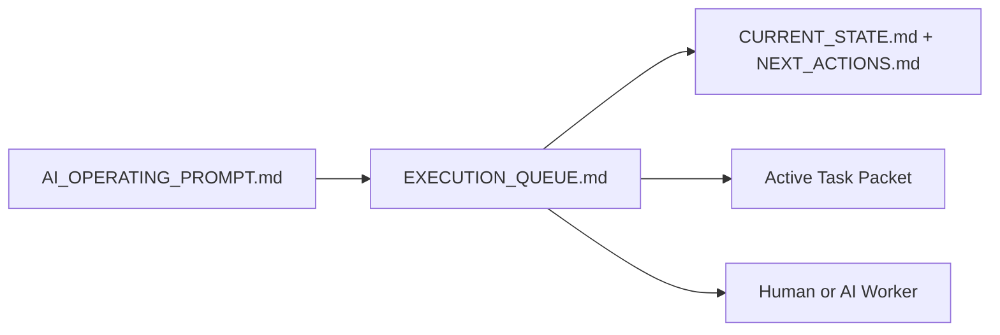

# PR Architecture Note: Execution Queue Status Board

## Summary

This PR adds a compact `ai_first/EXECUTION_QUEUE.md` file and links it from the existing AI-first entry points so both humans and AI workers can see the latest merge result, active queue, and next recommended task without reading the full operating prompt first.

## Mermaid Diagram



## Files Changed

- `ai_first/EXECUTION_QUEUE.md`
- `ai_first/AI_OPERATING_PROMPT.md`
- `ai_first/USAGE_GUIDE.md`
- `ai_first/README.md`
- `ai_first/CURRENT_STATE.md`
- `ai_first/NEXT_ACTIONS.md`
- `ai_first/daily/2026-04-19.md`
- `docs/superpowers/pr-notes/execution-queue-status-board.md`

## Main System Map Update

`ai_first/architecture/MAIN_SYSTEM_MAP.md` was not updated. This PR adds queue/reporting documentation and entry-point links without changing product/runtime architecture.

## Validation

```bash
rg -n "execution queue|status board|next task|blocker|GitHub Issue|Mermaid" ai_first docs/superpowers/tasks docs/superpowers/pr-notes
git diff --check
```

## Handoff Notes

- Keep `EXECUTION_QUEUE.md` short enough to read in under two minutes.
- Update the board after merges instead of duplicating full status in multiple places.
