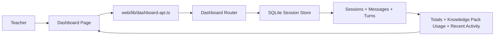

# PR Architecture Note: Pod A Teacher Dashboard MVP

## Summary

Adds a read-only Teacher Dashboard MVP that summarizes recent assessment and tutoring activity from the unified SQLite session store.

## Scope

- Dashboard API overview aggregation.
- Dashboard frontend API client.
- Workspace dashboard route.
- Sidebar navigation entry.
- API tests for dashboard overview and activity filtering.

## Mermaid Diagram



## Architecture Impact

The Teacher Dashboard now has a concrete read-only product route backed by the existing dashboard router and unified session store. No new persistence layer was added.

## Data/API Changes

- Adds `GET /api/v1/dashboard/overview`.
- Extends dashboard recent activity entries with `knowledge_bases`.
- Maps `deep_question` sessions to `assessment` and chat sessions to `tutoring`.

## Tests

```bash
pytest tests/api/test_dashboard_router.py -v
pytest tests/services/session -v
python3 -m compileall deeptutor
cd web && npm run build
```

## Main System Map Update

- [ ] Not needed, because:
- [x] Updated `ai_first/architecture/MAIN_SYSTEM_MAP.md`
