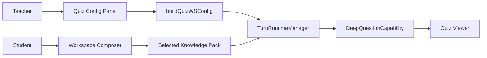

# PR Architecture Note: Pod B Assessment and Student Workspace MVP

## Summary

Adds the first Knowledge Pack-grounded assessment controls and student tutoring context support for Pod B.

## Scope

- Deep question requests now accept `subject` and pass it into generation preference context.
- Quiz UI exposes a subject control alongside count, difficulty, type, and preference.
- Quiz results surface common mistakes derived from validation issues.
- Unified turn runtime test coverage verifies `deep_question` config carries `subject` through to capability context.
- The main workspace already supports selecting a Knowledge Pack when RAG is active; this PR keeps that contract and focuses on stable request/response behavior.

## Mermaid Diagram



## Architecture Impact

The Assessment Builder now carries subject context into deep question generation, and the Student Tutor Workspace keeps Knowledge Pack selection in the turn payload through the existing unified WebSocket flow. The main system map was updated for the grounded quiz and tutoring-context flow.

## Data/API Changes

- `DeepQuestionRequestConfig` now includes `subject`.
- WebSocket question generation reads `subject` and folds it into generation preference text.
- Quiz question UI model includes `common_mistakes`.

## Tests

```bash
pytest tests/api/test_question_router.py -v
pytest tests/api/test_unified_ws_turn_runtime.py -v
python3 -m compileall deeptutor
cd web && npm run build
```

## Main System Map Update

- [ ] Not needed, because:
- [x] Updated `ai_first/architecture/MAIN_SYSTEM_MAP.md`
