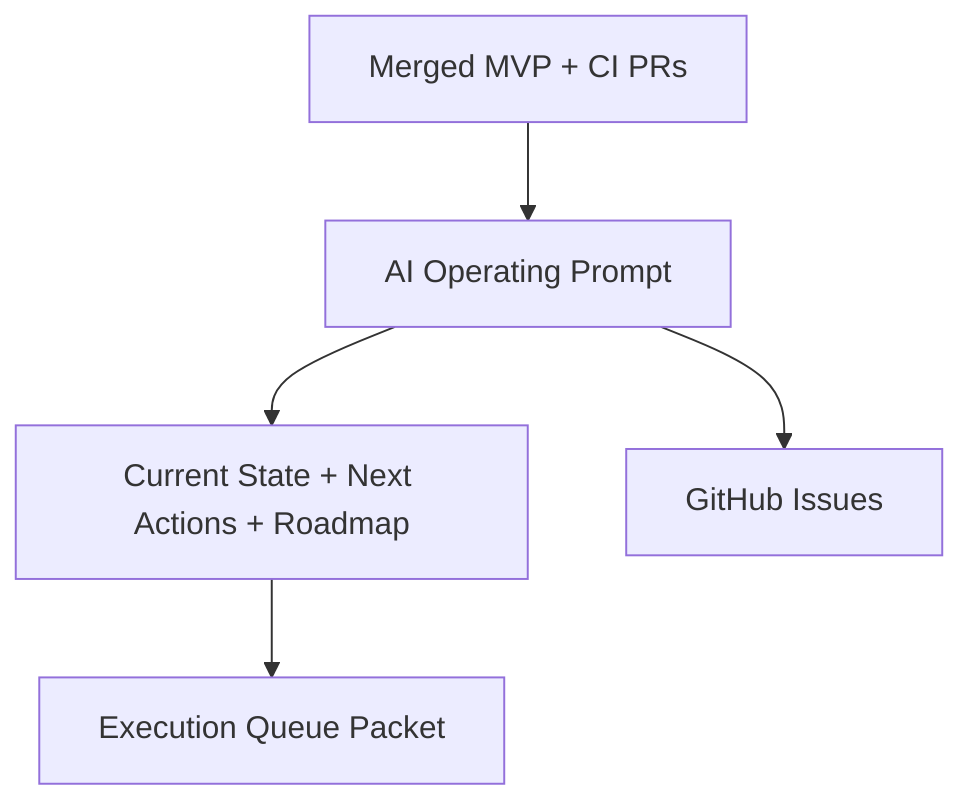

# PR Architecture Note: Post-CI State Sync

## Summary

This PR updates the AI-first control plane after the CI workflow landed in `main`, closes the gap between merged work and open execution issues, and queues the next docs/workflow packet for an execution status board.

## Mermaid Diagram



## Files Changed

- `ai_first/AI_OPERATING_PROMPT.md`
- `ai_first/AI_FIRST_ROADMAP.md`
- `ai_first/CURRENT_STATE.md`
- `ai_first/NEXT_ACTIONS.md`
- `ai_first/daily/2026-04-19.md`
- `docs/superpowers/tasks/2026-04-19-execution-queue-status-board.md`
- `docs/superpowers/pr-notes/post-ci-state-sync.md`

## Main System Map Update

`ai_first/architecture/MAIN_SYSTEM_MAP.md` was not updated. This PR syncs queue/reporting state and adds the next docs/workflow packet, but it does not change the product architecture or runtime topology.

## Validation

```bash
rg -n "execution queue|status board|next task|blocker|GitHub Issue|Mermaid" ai_first docs/superpowers/tasks docs/superpowers/pr-notes
git diff --check
```

## Handoff Notes

- Close stale issues for merged work before treating them as active queue items.
- Use issue `#19` and the new task packet as the next docs/workflow execution step.
