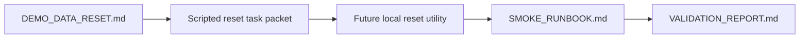

# PR Note: Scripted Demo Data Reset Packet

## Summary

This PR queues the next short implementation lane: a local idempotent utility for rebuilding contest demo-safe Knowledge Pack and session state before smoke/evidence refresh.

## Mermaid Diagram



## Architecture Impact

`ai_first/architecture/MAIN_SYSTEM_MAP.md` is not updated. This PR adds docs/workflow guidance for a future local demo helper and does not change product/runtime architecture.

## Validation

```bash
rg -n "demo data|reset|seed|smoke|Knowledge Pack|contest|Mermaid" docs/contest docs/superpowers/tasks docs/superpowers/pr-notes ai_first
git diff --check
```

## Handoff Notes

- Implement the utility only after this packet lands.
- Keep generated `data/` changes out of commits.
- Update `DEMO_DATA_RESET.md` with the final command when the utility exists.
