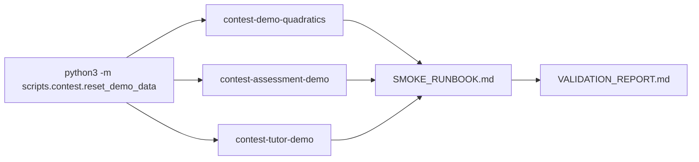

# PR Note: Scripted Demo Data Reset Utility

## Summary

This PR implements a local idempotent contest demo data reset utility. The utility creates or updates the demo-safe Knowledge Pack and session evidence used by smoke and contest evidence refresh docs.

## Mermaid Diagram



## Architecture Impact

`ai_first/architecture/MAIN_SYSTEM_MAP.md` is not updated. This PR adds a local contest/demo helper script and docs, not product/runtime architecture.

## Validation

```bash
pytest tests/scripts/test_reset_demo_data.py -v
rg -n "demo data|reset|seed|smoke|Knowledge Pack|contest|Mermaid" scripts tests docs/contest docs/superpowers/tasks docs/superpowers/pr-notes ai_first
python3 -m compileall scripts deeptutor
python3 -m scripts.contest.reset_demo_data --project-root /tmp/deeptutor-contest-demo-reset-smoke --api-base http://localhost:8001
git diff --check
```

## Handoff Notes

- Run `python3 -m scripts.contest.reset_demo_data --project-root . --api-base http://localhost:8001` before smoke when demo state is stale.
- Keep generated local `data/` changes out of commits.
