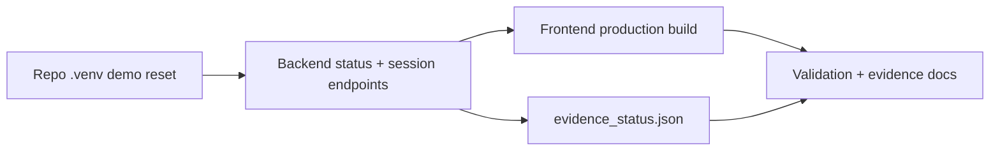

# PR Note: Session B Validation And Evidence Refresh

## Summary

This PR refreshes the Session B validation contract after a new 2026-04-28 smoke run in `.worktrees/submission-close-b`. It keeps command-backed evidence current, pins the smoke/demo-data runbooks to the repository virtualenv, and preserves older screenshot dates instead of overstating a same-day browser recapture.

## Mermaid Diagram



## Architecture Impact

`ai_first/architecture/MAIN_SYSTEM_MAP.md` is not updated. This lane refreshes validation and evidence wording only; it does not change runtime or system architecture.

## Validation

```bash
/Users/nguyenhuuloc/Documents/Multiagent-learning-platform/.venv/bin/python -m scripts.contest.reset_demo_data --project-root . --api-base http://localhost:8001
/Users/nguyenhuuloc/Documents/Multiagent-learning-platform/.venv/bin/python -m deeptutor_cli.main serve --host 127.0.0.1 --port 8001
curl -s http://127.0.0.1:8001/api/v1/system/status
curl -s http://127.0.0.1:8001/api/v1/knowledge/list
curl -s http://127.0.0.1:8001/api/v1/dashboard/overview
curl -s http://127.0.0.1:8001/api/v1/dashboard/recent
curl -s http://127.0.0.1:8001/api/v1/sessions/contest-assessment-demo
curl -s http://127.0.0.1:8001/api/v1/sessions/contest-tutor-demo
cd web && npm ci && npm run build
PATH="/Users/nguyenhuuloc/Documents/Multiagent-learning-platform/.venv/bin:$PATH" /Users/nguyenhuuloc/Documents/Multiagent-learning-platform/.venv/bin/python -m scripts.contest.refresh_evidence_status --project-root . --api-base http://localhost:8001
rg -n "2026-04-28|2026-04-26|Current|Deferred|repo \\.venv|PATH=" docs/contest ai_first/evidence docs/superpowers/tasks docs/superpowers/pr-notes
git diff --check
```

## Handoff Notes

- Command-backed smoke passed on 2026-04-28 for Knowledge Pack, assessment session, tutor session, dashboard endpoints, and frontend build.
- The helper that writes `ai_first/evidence/evidence_status.json` still depends on `python3` inside its subprocess call, so Session B documented the required `PATH` prefix instead of changing runtime code from a docs lane.
- Session B did not perform a fresh browser screenshot recapture; screenshot rows remain current on their last real capture dates.
