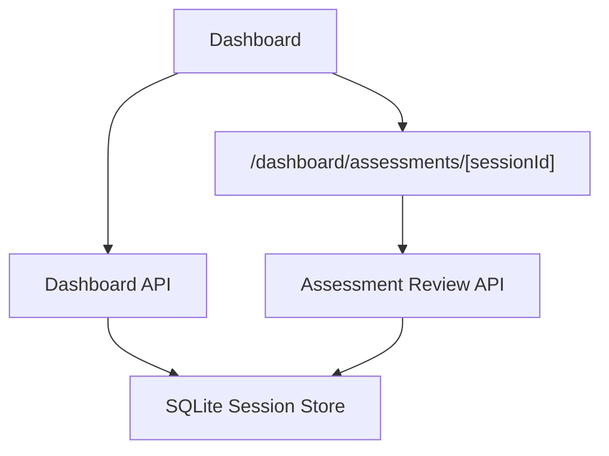

# PR Architecture Note: Teacher Assessment Review MVP

## Summary

Adds Dashboard drill-down into a dedicated assessment session review page backed by structured assessment review data extracted from session history.

## Scope

- Adds assessment review extraction from quiz-result session messages.
- Adds `/api/v1/sessions/{session_id}/assessment-review`.
- Enriches Dashboard activity rows with assessment summary data and review links.
- Adds `/dashboard/assessments/[sessionId]` for teacher-facing per-question review.

## Mermaid Diagram

## Architecture Impact

Adds a teacher-facing review route and one session API endpoint. No new storage table is introduced; the MVP reuses existing session history.

## Data/API Changes

- New response shape includes session metadata, Knowledge Pack names, score summary, and ordered question results.
- Existing Dashboard overview activity rows may include `assessment_summary` and `review_ref`.

## Main System Map Update

- [x] Updated `ai_first/architecture/MAIN_SYSTEM_MAP.md`
- [ ] Not needed
