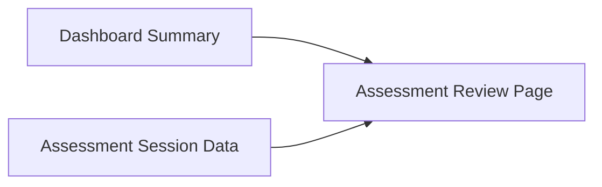

# PR Architecture Note: Teacher Assessment Review Packet

## Summary

Adds the feature packet for teacher-facing assessment review from Dashboard into a dedicated assessment session page.

## Scope

- Defines owned files and do-not-touch boundaries for the Teacher Assessment Review MVP.
- Keeps Dashboard as the summary surface and the dedicated review route as the detail surface.

## Mermaid Diagram

## Architecture Impact

Packet-only documentation. Runtime/API architecture changes happen in the implementation PR.

## Main System Map Update

- [x] Not needed for packet-only docs.
- [ ] Updated `ai_first/architecture/MAIN_SYSTEM_MAP.md`
