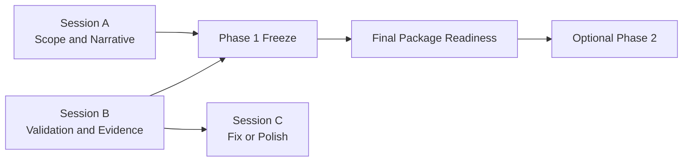

# PR Note: Three-Session Submission Close Plan

## Summary

- add a master coordination packet for the submission-close train
- add three session packets with low-conflict file ownership
- point AI-first mirrors to the new execution path
- record the current known pytest baseline status so workers do not confuse pre-existing failures with planning-layer regressions

## Mermaid

## Main System Map

- Not updated. This planning PR changes coordination and documentation workflow, not runtime/product architecture.
