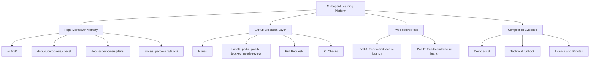
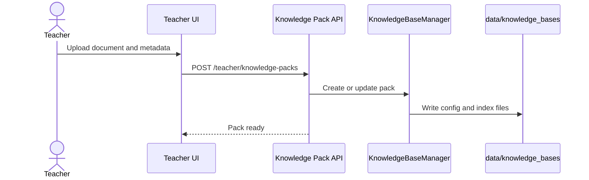

# AI-first Project Operating System Design

Date: 2026-04-12  
Repository: `Creative-Science-Contest-2026/Multiagent-learning-platform`  
Contest target: VnExpress Sáng kiến Khoa học 2026  
Design status: Approved by project owner in brainstorming session

## 1. Purpose

This project will be run as an AI-first competition project. The human team provides direction, product judgment, final acceptance, and feedback. AI agents propose, plan, implement, test, document, open pull requests, and leave handoff notes.

The product goal is a stable contest MVP:

> A teacher creates a Knowledge Pack from learning materials, generates assessments, assigns the pack to a student learning flow, the student learns with a Tutor Agent, and the teacher sees a simple progress dashboard.

The operating goal is to let two machines and two AI agents work continuously without losing context, overwriting each other, or drifting away from the contest story.

## 2. Contest Constraints

The system should be designed around the VnExpress Sáng kiến Khoa học 2026 criteria:

- Creativity, technology, and novelty.
- Practical applicability in Vietnam.
- Efficiency and productivity improvement.
- Development and commercialization potential.
- Community value, especially education access.

The submission period is 2026-02-09 to 2026-04-30. The project must therefore prioritize a reliable demo, clear evidence, and a coherent story over broad feature count.

## 3. Selected Approach

The approved approach is a hybrid AI-first operating system.

Markdown files in the repository are the long-term source of truth. GitHub Issues and Pull Requests coordinate active execution.



## 4. Repository Structure

The operating system will use this structure:

```text
ai_first/
├── README.md
├── AI_OPERATING_PROMPT.md
├── CURRENT_STATE.md
├── NEXT_ACTIONS.md
├── architecture/
│   ├── README.md
│   ├── MAIN_SYSTEM_MAP.md
│   └── feature-maps/
├── competition/
│   ├── vnexpress-rules-summary.md
│   ├── submission-checklist.md
│   └── pitch-notes.md
├── decisions/
│   └── ADR-0001-ai-first-operating-model.md
├── daily/
│   └── YYYY-MM-DD.md
├── evidence/
│   ├── demo-script.md
│   ├── screenshots.md
│   └── technical-runbook.md
├── prompts/
│   └── README.md
└── templates/
    ├── daily-log.md
    ├── feature-pod-task.md
    ├── handoff-note.md
    └── pr-architecture-note.md

docs/superpowers/
├── specs/
├── plans/
└── tasks/
    ├── README.md
    └── templates/
```

Responsibilities:

- `ai_first/`: project memory, competition strategy, architecture maps, prompt history, daily logs, and submission evidence.
- `docs/superpowers/specs/`: approved designs.
- `docs/superpowers/plans/`: implementation plans produced after approved specs.
- `docs/superpowers/tasks/`: execution packets for Feature Pods.
- GitHub Issues: active execution mirrors of task packets.
- Pull Requests: implementation handoff, review, tests, and architecture notes.

## 5. AI Injection

The repository already has `AGENTS.md`. A new AI-first section should be prepended to it without deleting existing DeepTutor architecture instructions.

The injected section should instruct every AI agent to:

1. Read `ai_first/AI_OPERATING_PROMPT.md`.
2. Read `ai_first/CURRENT_STATE.md`.
3. Read `ai_first/NEXT_ACTIONS.md`.
4. Check `git status`.
5. Work only inside the assigned task scope.
6. Use a branch, not `main`, for code changes.
7. Update daily logs and handoff notes after work.
8. Update architecture maps when feature structure changes.
9. Run relevant tests and document the result.

`ai_first/AI_OPERATING_PROMPT.md` is the deeper operating prompt. It should define behavior for AI proposal, implementation, testing, PR writing, task handoff, and update discipline.

`ai_first/CURRENT_STATE.md` is the compact project snapshot. It should include current MVP goal, active milestones, active branches or PRs, key architecture decisions, and known risks.

`ai_first/NEXT_ACTIONS.md` is the short ordered queue of work. It should not become a full backlog; GitHub Issues and task packets handle detailed execution.

## 6. Branch, Issue, and PR Workflow

### Branches

Each AI works on a separate branch:

```text
pod-a/<short-feature-name>
pod-b/<short-feature-name>
docs/<spec-or-plan-name>
fix/<small-bug-name>
```

No AI should push directly to `main`.

### Task Packets

Each end-to-end feature must have a task packet before implementation:

```text
docs/superpowers/tasks/YYYY-MM-DD-<feature>-pod-a.md
docs/superpowers/tasks/YYYY-MM-DD-<feature>-pod-b.md
```

Required fields:

```text
Owner
Branch
GitHub Issue
Goal
User-visible outcome
Owned files/modules
Do-not-touch files/modules
API/data contract
Acceptance criteria
Required tests
Manual verification
Handoff notes
```

`Owned files/modules` and `Do-not-touch files/modules` are mandatory because the project will use Two Feature Pods.

### GitHub Issues

Issues mirror active task packets. Recommended labels:

```text
pod-a
pod-b
feature
bug
docs
blocked
needs-review
competition
```

Issue bodies should link to the task packet Markdown. Pull requests should link issues with `Refs #...` or `Closes #...`.

### Pull Requests

PRs must include:

- Summary.
- User-visible changes.
- Files/modules touched.
- Tests run.
- Screenshots or video notes for UI changes.
- Risk and rollback notes.
- AI handoff notes.
- PR architecture note link.

Large PRs require human review. Small PRs may be auto-merged later if CI is reliable and passing.

## 7. Architecture Map and Mermaid Contract

The project will maintain a main architecture map:

```text
ai_first/architecture/MAIN_SYSTEM_MAP.md
```

This file is the high-level Mermaid map of the product and architecture. It must show:

- Entry points: Web, API, CLI.
- Agent runtime: `ChatOrchestrator`, `ToolRegistry`, `CapabilityRegistry`, `StreamBus`.
- Product layer: Teacher Workspace, Knowledge Pack, Assessment Builder, Student Tutor Workspace, Teacher Dashboard.
- Data layer: SQLite, knowledge bases, memory, settings, workspace artifacts.
- AI-first layer: specs, plans, tasks, PRs, evidence.

Every PR must include a Markdown architecture note:

```text
docs/superpowers/pr-notes/<branch-or-pr-number>-<short-name>.md
```

The note must include at least one Mermaid diagram for the feature or change.

Required PR architecture note sections:

```text
# PR Architecture Note: <feature/change>

## Summary
## Scope
## Mermaid Diagram
## Architecture Impact
## Data/API Changes
## Tests
## Main System Map Update
- [ ] Not needed, with reason
- [ ] Updated `ai_first/architecture/MAIN_SYSTEM_MAP.md`
```

`MAIN_SYSTEM_MAP.md` must be updated when a PR adds, removes, or materially changes:

- a capability;
- a tool;
- an API router;
- a major frontend route;
- a data model or storage location;
- the Teacher to Student to Dashboard flow;
- the AI-first operating workflow.

Each major feature should also have a feature map:

```text
ai_first/architecture/feature-maps/<feature-name>.md
```

Example feature map:



## 8. MVP Milestones

### Milestone 0: AI-first Project OS

Goal: every AI entering the repo knows how to work, update logs, split tasks, and open PRs.

Deliverables:

- AI-first section in `AGENTS.md`.
- `ai_first/AI_OPERATING_PROMPT.md`.
- `ai_first/CURRENT_STATE.md`.
- `ai_first/NEXT_ACTIONS.md`.
- Architecture map and templates.
- Spec, plan, task folders.

### Milestone 1: Competition Demo Narrative

Goal: prepare the contest story before heavy coding.

Deliverables:

- VnExpress rules summary.
- Submission checklist.
- Demo script.
- Technical runbook.
- License and IP notes for Apache 2.0 and the HKUDS/DeepTutor fork.

### Milestone 2: Teacher Knowledge Pack MVP

Goal: teachers create education-oriented knowledge packs.

Deliverables:

- Metadata around knowledge bases: subject, grade, curriculum, learning objectives, owner, sharing status.
- Simple UI in Knowledge or Teacher page.
- Minimal API for reading and writing pack metadata.
- Backend tests for metadata persistence.

### Milestone 3: Assessment Builder MVP

Goal: teachers generate exercises from a selected Knowledge Pack.

Deliverables:

- Vietnamese prompt/config support for question generation.
- Form for topic, grade, subject, count, difficulty, and question type.
- Output with answers, explanations, and common mistakes.
- Tests for question API or prompt configuration.

### Milestone 4: Student Tutor Workspace MVP

Goal: students learn with a Tutor Agent grounded in a selected Knowledge Pack.

Deliverables:

- Student mode in chat workspace.
- Selected Knowledge Pack is passed into the chat context.
- Tutor answers use pack retrieval when available.
- Sessions and turn events continue to persist in existing SQLite storage.

### Milestone 5: Teacher Dashboard MVP

Goal: teachers see simple progress evidence for the demo.

Deliverables:

- Dashboard with session count, generated question count, studied topics, and weak areas if available.
- Data can initially come from the existing SQLite session store and knowledge/question metadata.
- UI is suitable for screenshots and demo video.

## 9. Feature Pod Split

The first shared PR should implement Milestone 0 and Milestone 1 operating files. After that, two pods can work in parallel.

Recommended split:

- Pod A: Teacher Knowledge Pack MVP and Teacher Dashboard MVP.
- Pod B: Assessment Builder MVP and Student Tutor Workspace MVP.

Shared contract changes should be isolated in small PRs before pods continue. Examples include router registration, shared API client types, shared data model names, or architecture map changes affecting both pods.

## 10. Testing and Verification

Each PR must document tests run.

Backend/docs/setup PRs should run, when feasible:

```bash
python3 -m compileall deeptutor deeptutor_cli
pytest tests/core tests/api tests/services tests/knowledge
```

Frontend PRs should run, when feasible:

```bash
cd web
npm run lint
npm run build
```

If tests cannot be run, the PR must explain why and list substitute checks.

UI PRs must include manual verification steps and screenshot or video notes when possible.

## 11. Guardrails

AI agents must follow these rules:

- Do not push directly to `main`.
- Do not modify files outside the assigned task scope unless the task packet is updated first.
- Do not remove original Apache 2.0 license or upstream credit.
- Do not remove major features without an approved spec and implementation plan.
- Do not change lockfiles unless dependency changes require it.
- Check dirty worktree before making changes.
- Treat shared contracts as separate small PRs when two pods depend on them.
- Update `ai_first/daily/YYYY-MM-DD.md` after work.
- Update `CURRENT_STATE.md` or `NEXT_ACTIONS.md` when project status changes.
- Update Mermaid architecture maps when structure changes.

## 12. Human Review Checkpoints

The human team should review:

- specs before implementation plans;
- milestone plans before feature work;
- large PRs and shared contract PRs;
- demo behavior at the end of each milestone;
- final contest evidence before submission.

## 13. Non-goals

This spec does not implement the product MVP. It defines how the project will be operated so two AI agents can safely build the MVP.

This spec does not require GitHub Projects setup on day one. Issues and PRs are enough initially.

This spec does not require full CI before the first operating-system PR. CI can be introduced after the initial repository conventions are committed.
