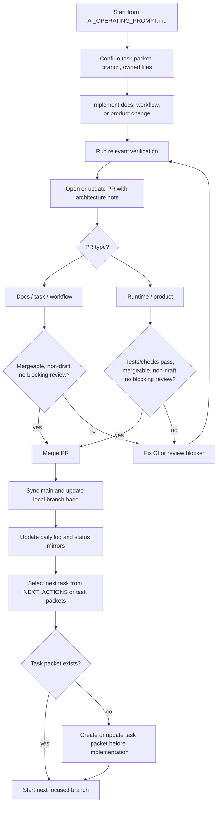

# Autonomous AI Loop Design

Date: 2026-04-18  
Repository: `Creative-Science-Contest-2026/Multiagent-learning-platform`  
Design status: Approved by project owner in brainstorming session

## 1. Purpose

The AI-first operating layer should not stop after a worker finishes code or opens a pull request. It should know how to complete the current PR safely, merge it when allowed, sync the repository, select the next useful task, and continue toward the long-term contest MVP.

The human role should be product direction and result review. A human should be able to check progress after time away and see:

- what PRs were merged;
- what CI or review blockers were fixed;
- what task is currently active;
- what AI plans to do next;
- how the AI-first operating model is evolving.

## 2. Selected Merge Policy

The approved policy is the safe autonomous policy:

- AI may auto-merge docs, task, and workflow PRs when the PR is mergeable, non-draft, and has no blocking review or unresolved required discussion.
- AI may auto-merge runtime or product PRs only when relevant tests or required checks pass and there is no blocking review.
- If CI fails, AI must stop feature progression, diagnose and fix CI on the same PR, then re-check.
- If a review blocks the PR, AI must address the review before merging or continuing.
- AI must not push directly to `main`.

## 3. Autonomous Execution Loop

Every AI worker should treat pull request completion as part of the task, not as a separate human-only step.



## 4. Next Work Source

The AI should pick work from this order:

1. Active PR blockers: failing CI, requested changes, merge conflicts, or stale branch state.
2. Active task packets in `docs/superpowers/tasks/`.
3. The compact queue in `ai_first/NEXT_ACTIONS.md`.
4. The long-term MVP goal in `ai_first/AI_OPERATING_PROMPT.md`.

If no task packet exists for the next product change, AI should create a task packet first. It should not jump straight into runtime implementation from a vague long-term goal.

## 5. AI-First Roadmap Document

After the current task packet and PR workflow work is complete, the repository should include a dedicated Markdown document that explains the AI-first operating model and its future direction.

Recommended path:

```text
ai_first/AI_FIRST_ROADMAP.md
```

The document should include:

- the long-term project goal;
- how AI chooses the next task;
- how AI completes, fixes, merges, and records PR work;
- what still requires human judgment;
- near-term, mid-term, and later AI-first operating improvements;
- at least one Mermaid diagram explaining the loop.

This document is human-facing. It should be easy to read in the morning or while away from the machine, without requiring the reader to inspect every task packet or PR.

## 6. Files to Update During Implementation

Owned files for the implementation:

- `ai_first/AI_OPERATING_PROMPT.md`
- `ai_first/USAGE_GUIDE.md`
- `ai_first/NEXT_ACTIONS.md`
- `ai_first/CURRENT_STATE.md`, only if the compact status mirror changes
- `ai_first/AI_FIRST_ROADMAP.md`
- `ai_first/daily/2026-04-18.md`
- `docs/superpowers/pr-notes/<branch-or-pr>.md`

Do-not-touch files:

- backend runtime code;
- frontend runtime code;
- package lockfiles;
- unrelated dirty files already present in the worktree.

## 7. Validation

This is a docs and workflow change. Validation should include:

```bash
rg -n "auto-merge|Autonomous|AI_FIRST_ROADMAP|blocking review|task packet" ai_first docs/superpowers
git diff --check
```

If GitHub state is part of the implementation, also inspect the active PR:

```bash
gh pr view 4 --json number,title,state,isDraft,mergeable,reviewDecision,statusCheckRollup,headRefName,baseRefName,url
```

## 8. Out of Scope

This design does not add GitHub Actions automation, background daemons, scheduler scripts, or unattended credential handling. Those may be added later after the documentation-only operating loop proves stable.
