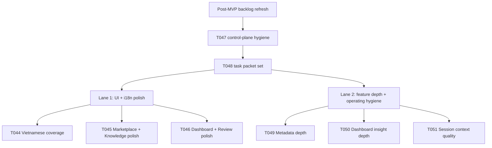

# Two-Lane Contest MVP Polish Design

Date: 2026-04-25
Scope: New post-MVP backlog for contest-facing quality improvements, optimized for two parallel AI sessions on two accounts or machines

## Context

The original MVP backlog is complete in the sense that the major contest features are merged into `main`.

That does not mean the product is finished.

Current repo state still shows three practical gaps:

1. Contest MVP screens are not fully polished for Vietnamese-first use. Some UI text is still English, translations are uneven, and empty/loading/error states are not consistently localized.
2. Several merged features are only first-slice implementations. They function, but the user experience still feels thin or abrupt in key contest flows.
3. The repo now has rules for parallel work, but the next real test is operational: can two AI sessions on two accounts or machines make progress in parallel without excessive file conflicts or coordination drift?

The next backlog should therefore optimize for:

- visible product quality improvements on contest MVP screens
- deeper behavior in already-merged MVP flows
- clean ownership boundaries so two sessions can run in parallel with low merge friction

## Goal

Create a focused two-lane backlog for the next iteration so the team can:

- improve the contest MVP product quality in user-visible ways
- stress-test real two-session execution on separate accounts or machines
- measure where ownership rules and operating docs do or do not prevent conflicts

## Non-goals

- broad polish for non-contest playground surfaces
- large architectural rewrites across unrelated modules
- opening more than two simultaneous active implementation lanes
- forcing both lanes to touch the same route, component, or data contract at the same time

## Recommended structure

Use two lanes with intentionally different ownership boundaries.

### Lane 1: Contest Screen Polish and Vietnamese UI Depth

Primary outcome:
Contest-facing MVP screens feel locally coherent, more complete, and less obviously English-first.

Primary file ownership:

- `web/app/(utility)/marketplace/`
- `web/app/(utility)/knowledge/`
- `web/app/(workspace)/dashboard/`
- `web/app/(workspace)/dashboard/assessments/`
- `web/app/(workspace)/dashboard/sessions/`
- `web/components/assessment/`
- `web/components/quiz/`
- `web/locales/vi/`

Do-not-touch by default:

- backend API routers
- `web/lib/` contracts unless a task packet explicitly widens scope
- `ai_first/` control-plane files

Why this lane exists:

- it produces immediately visible improvement
- it is mostly frontend-only
- it is the lowest-conflict way to validate whether contest MVP screens really feel finished

### Lane 2: Feature Depth and Two-Session Operating Hygiene

Primary outcome:
Contest MVP flows feel less shallow, and the repo becomes more reliable for real parallel execution.

Primary file ownership:

- `deeptutor/api/routers/knowledge.py`
- `deeptutor/api/routers/marketplace.py`
- `deeptutor/api/routers/dashboard.py`
- `deeptutor/api/routers/sessions.py`
- `deeptutor/services/`
- `web/lib/`
- `ai_first/`
- `docs/superpowers/tasks/`
- `docs/superpowers/pr-notes/`

Do-not-touch by default:

- contest screen page components already assigned to Lane 1
- `web/locales/vi/` unless a task packet explicitly requires new keys and coordinates with Lane 1

Why this lane exists:

- it deepens behavior instead of only polishing labels
- it exercises backend and operating-layer coordination at the same time
- it lets the team learn where two sessions still collide in practice

## Proposed backlog

The proposed backlog is intentionally small enough for one focused parallel experiment, but large enough to keep both lanes busy without forcing overlap.

### Lane 1 task set

#### T044: Contest MVP Vietnamese Coverage Audit and Fix Pass

Goal:
Close obvious English leakage on contest MVP screens and align Vietnamese wording across the user-facing flow.

Owned files:

- `web/app/(utility)/marketplace/page.tsx`
- `web/app/(utility)/knowledge/page.tsx`
- `web/app/(workspace)/dashboard/page.tsx`
- `web/app/(workspace)/dashboard/student/page.tsx`
- `web/app/(workspace)/dashboard/assessments/[sessionId]/page.tsx`
- `web/app/(workspace)/dashboard/sessions/[sessionId]/page.tsx`
- `web/locales/vi/app.json`
- `web/locales/vi/common.json`

Acceptance shape:

- no obvious English-only labels remain on contest MVP screens when Vietnamese is selected
- empty/loading/error states use deliberate Vietnamese copy instead of fallback raw English strings
- wording is consistent for repeated concepts such as Knowledge Pack, assessment, tutor, dashboard, review, and replay

#### T045: Marketplace and Knowledge Pack Screen Polish

Goal:
Make the teacher-facing pack creation and discovery surfaces feel less prototype-like.

Owned files:

- `web/app/(utility)/marketplace/page.tsx`
- `web/app/(utility)/marketplace/error.tsx`
- `web/app/(utility)/knowledge/page.tsx`

Acceptance shape:

- marketplace cards and filters read clearly in Vietnamese
- pack preview, import, and empty states feel intentional rather than generic
- knowledge metadata editing flow exposes clearer labels, hints, and status feedback

#### T046: Dashboard and Review Screen Copy and UX Polish

Goal:
Improve the readability and flow quality of dashboard, assessment review, and tutor replay screens without changing backend contracts.

Owned files:

- `web/app/(workspace)/dashboard/page.tsx`
- `web/app/(workspace)/dashboard/student/page.tsx`
- `web/app/(workspace)/dashboard/assessments/[sessionId]/page.tsx`
- `web/app/(workspace)/dashboard/sessions/[sessionId]/page.tsx`
- `web/components/assessment/LearningJourneySummary.tsx`
- `web/components/assessment/ProgressIndicator.tsx`

Acceptance shape:

- dashboard sections have clearer labels and more intentional empty states
- review and replay pages explain status and next actions more cleanly
- the overall contest demo path reads like a coherent teacher workflow rather than a collection of raw slices

### Lane 2 task set

#### T047: Contest Flow Operating Hygiene Refresh

Goal:
Refresh stale coordination docs so two parallel sessions can start with accurate state and ownership contracts.

Owned files:

- `ai_first/ACTIVE_ASSIGNMENTS.md`
- `ai_first/EXECUTION_QUEUE.md`
- `ai_first/AI_OPERATING_PROMPT.md`
- `ai_first/CURRENT_STATE.md`
- `ai_first/NEXT_ACTIONS.md`
- `ai_first/daily/2026-04-25.md`

Acceptance shape:

- no stale active assignment remains from merged work
- the queue explicitly describes the new two-lane experiment
- startup instructions for parallel work point future workers to assignment-before-code discipline

#### T048: Parallel Lane Task Packet Set

Goal:
Create explicit task packets for the new two-lane experiment so each account has bounded owned files and do-not-touch rules.

Owned files:

- `docs/superpowers/tasks/`
- `docs/superpowers/pr-notes/`

Acceptance shape:

- each active task has a packet with owned files and do-not-touch files
- packets avoid shared ownership by default
- packets define how to coordinate if one lane needs contract changes from the other

#### T049: Knowledge and Marketplace Metadata Depth Pass

Goal:
Make teacher-facing pack metadata and marketplace details feel more complete without redesigning the overall product.

Owned files:

- `deeptutor/api/routers/knowledge.py`
- `deeptutor/api/routers/marketplace.py`
- `deeptutor/knowledge/manager.py`
- `web/lib/knowledge-api.ts`
- `web/lib/marketplace-api.ts`
- targeted tests for the same contracts

Acceptance shape:

- marketplace preview and pack metadata expose richer teacher-useful detail
- metadata contracts stay backward compatible
- new fields are test-covered and do not force Lane 1 page rewrites during the same window

#### T050: Dashboard Insight Depth Pass

Goal:
Make teacher dashboard summaries and review outputs more actionable without expanding into a new analytics subsystem.

Owned files:

- `deeptutor/api/routers/dashboard.py`
- `deeptutor/services/session/assessment_review.py`
- `web/lib/dashboard-api.ts`
- targeted dashboard tests

Acceptance shape:

- dashboard and review payloads surface clearer next-step signals
- additional depth remains explainable and bounded by existing routes
- frontend contract additions are incremental and documented for Lane 1

#### T051: Tutor and Assessment Session Context Quality Pass

Goal:
Improve the usefulness of assessment-review and tutoring-session context so the contest learning loop feels less thin.

Owned files:

- `deeptutor/api/routers/sessions.py`
- `deeptutor/agents/chat/agentic_pipeline.py`
- `web/lib/session-api.ts`
- targeted session and agent tests

Acceptance shape:

- session review and tutoring traces expose cleaner context for downstream UI
- changes stay within existing session and reply flows rather than creating new route families
- follow-up behavior remains grounded and testable

## Execution order

Start with one bootstrap task in Lane 2, then open both lanes in parallel.

1. Land `T047` first so the control plane reflects the experiment.
2. Open `T048` immediately after or in the same PR if the scope remains docs-only and tightly coupled.
3. Once assignment board and task packets are current, run:
   - Lane 1 on `T044`, then continue to `T045` and `T046`
   - Lane 2 on `T049`, `T050`, or `T051` based on smallest clean slice

This sequence matters because the operating layer should describe the experiment before the experiment starts.

## Conflict minimization rules

To make the two-session test meaningful, conflict avoidance must be built into the backlog rather than left to luck.

Rules:

- Lane 1 owns contest page components and Vietnamese locale files.
- Lane 2 owns backend contracts, API clients, task packets, and AI-first coordination docs.
- `web/lib/` is Lane 2-owned unless explicitly delegated.
- If Lane 2 adds response fields consumed by Lane 1, that contract must be written in the task packet before Lane 1 touches the UI.
- No task should require simultaneous edits to both `web/locales/vi/` and backend routers.
- Only one active task at a time per account.
- Assignment entries must be added before code work begins.

## Success criteria for the experiment

The experiment succeeds if:

- both lanes produce merged improvements that are visible and defensible
- each lane can complete work without repeated manual untangling of overlapping files
- any conflicts that do occur are traceable to a specific ownership gap that can be fixed in the operating docs
- the team learns whether two-account parallel execution is practically faster than a single serial lane

## Risks

- Lane 1 may discover missing API data and try to widen scope into Lane 2 territory.
- Lane 2 may add API fields that tempt frontend edits outside its ownership boundary.
- Locale fixes can become unbounded if the team expands beyond contest MVP surfaces.
- The stale `ACTIVE_ASSIGNMENTS.md` state shows that the operating layer itself already needs cleanup before parallel work starts.

## Recommendation

Approve this design as the next backlog shape, then convert the selected tasks into:

- updated `ai_first/TASK_REGISTRY.json` entries
- lane-specific task packets
- refreshed assignment board entries when the two accounts begin work

## Mermaid

