# Contest MVP+ Hybrid Lanes Design

Date: 2026-04-26
Status: Drafted for user review
Scope: A 6-8 week Contest MVP+ roadmap that proves both teacher-defined agent authoring and an evidence-backed teaching insight loop on top of the current codebase

## Purpose

This design defines a near-term product roadmap for the Multiagent Learning Platform after the current contest MVP baseline. The target is a usable `Hybrid proof`:

- teachers can define the soul and operating rules of a teaching agent through a Markdown-first spec standard with a narrow authoring UI;
- students can learn through one teacher-authored agent template while retaining distinct student states;
- the system can transform learning activity into `Observed -> Inferred -> Recommended Action` outputs for teachers.

The roadmap is intentionally constrained to what can be executed on the current repository in 6-8 weeks. It does not attempt a full true multi-agent system yet.

## Product Thesis for This Phase

The product should prove three claims at the same time:

1. Teacher authorship matters.
   A teacher-defined spec pack should materially shape tutor behavior, assessment framing, and intervention tone.
2. Evidence matters.
   The system should not jump directly from chat logs to vague advice. It should record observations, produce bounded diagnosis, and recommend explicit next actions.
3. Personalization should happen through state, not agent sprawl.
   One teacher-defined agent template should serve many students, with differentiation carried by `Student State` and `Session State`.

## Phase Decisions

The roadmap assumes these product decisions:

- Delivery horizon: `Contest MVP+` in 6-8 weeks.
- Success mode: `Hybrid proof`, not authoring-only and not analytics-only.
- Core runtime model: `one agent template + many student states`.
- Authoring mode: `Hybrid narrow`.
- Diagnosis mode: `Hybrid balanced`.
- Teacher action surface: `per-student + small-group`.
- Backbone priority: `Observation / Diagnosis / Recommendation Pipeline`.
- Delivery structure: `6 lanes`.

## Design Principles

- Keep `Teacher Spec`, `Student State`, and `Session State` separate.
- Keep `Observed`, `Inferred`, and `Recommended Action` as three distinct layers.
- Let Markdown remain the source of truth even when a form UI edits part of the spec.
- Prefer policy-driven behavior over hardcoded feature-specific prompt fragments.
- Build only the smallest authoring, diagnosis, and dashboard surfaces needed to show the thesis end to end.
- Reuse existing tutor, assessment, dashboard, knowledge-pack, and contest evidence infrastructure where possible.

## Architecture Shape

```mermaid
flowchart LR
  Teacher["Teacher Spec Authoring"] --> SpecPack["Markdown Spec Pack"]
  SpecPack --> Runtime["Spec Runtime Assembly"]
  Runtime --> Tutor["Tutor + Assessment Runtime"]
  Tutor --> Observed["Observed Signals"]
  Observed --> StudentState["Student State"]
  Observed --> Diagnosis["Diagnosis Engine"]
  StudentState --> Diagnosis
  Diagnosis --> Recommended["Recommended Actions"]
  Recommended --> TeacherUI["Teacher Insight UI"]
  TeacherUI --> Intervention["Teacher Intervention"]
```

This architecture keeps the system intentionally single-agent in runtime execution while preserving boundaries for future separation into tutor, assessment, diagnosis, and intervention agents.

## Six-Lane Roadmap

### Lane 1: Agent Spec Authoring

Goal:
Enable a teacher to define and maintain a usable teaching agent through a Markdown-backed spec pack, with a narrow UI for the highest-leverage files.

Boundaries:
- Owns teacher-authored policy artifacts.
- Does not own student evidence, diagnosis logic, or dashboard interpretation.

Output:
- A versioned `Spec Pack` that can be compiled into runtime configuration.

Tasks:
1. Define the canonical folder structure for `agent_specs/<agent_id>/`.
2. Define the required contract for `IDENTITY.md`, `SOUL.md`, `CURRICULUM.md`, `RULES.md`, `ASSESSMENT.md`, `WORKFLOW.md`, `KNOWLEDGE.md`, and `MARKETPLACE.md`.
3. Create a light schema for `IDENTITY`, `SOUL`, and `RULES` so a form can map to Markdown without lossy translation.
4. Design a `compiled spec pack` artifact that runtime code can consume without reading raw UI state.
5. Build the narrow authoring flow for `IDENTITY`, `SOUL`, and `RULES`.
6. Add manual or structured Markdown editing for `CURRICULUM`, `ASSESSMENT`, `WORKFLOW`, `KNOWLEDGE`, and `MARKETPLACE`.
7. Add validation for required fields, subject scope, language, and guardrails.
8. Add a runtime preview summary so the teacher can inspect how the current spec will steer the agent.
9. Add version notes or change history metadata when a spec pack is edited.
10. Add an internal `draft/published` state for a spec pack.
11. Expose metadata summary fields that later marketplace views can read.
12. Add import/export of the Markdown pack to prove portability and source-of-truth integrity.

### Lane 2: Spec Runtime Assembly

Goal:
Compile teacher policy into a predictable runtime contract shared by tutoring and assessment flows.

Boundaries:
- Owns runtime assembly and policy application.
- Does not own raw observation capture or teacher-facing interpretation.

Output:
- A reusable assembly layer that merges `Teacher Spec`, `Student State`, and `Session State` at runtime.

Tasks:
1. Define explicit contracts for `Teacher Spec`, `Student State`, and `Session State`.
2. Create a loader that reads a spec pack and produces a compiled runtime payload.
3. Build prompt assembly by slices instead of injecting the full pack into every request.
4. Apply `SOUL` and `RULES` consistently to tutor responses.
5. Apply `WORKFLOW` to the progression of instruction, practice, checking, and remediation.
6. Apply `ASSESSMENT` to question framing, review behavior, and feedback tone.
7. Apply `KNOWLEDGE` using a default `kb_preferred` policy.
8. Enforce source priority: `teacher_kb > curriculum excerpt > teacher rules > llm prior knowledge`.
9. Add safeguards that stop the tutor from drifting beyond teacher-defined scope.
10. Unify the assembly contract so tutor and assessment paths use the same policy basis.
11. Add runtime debug output that shows which slices were assembled for a request.
12. Preserve clear seams so future specialized agents can take over without rewiring policy storage.

### Lane 3: Observation and Student State

Goal:
Establish a reliable `Observed` layer and a separate dynamic student profile.

Boundaries:
- Owns event capture, observation schema, and state summary updates.
- Does not own diagnosis claims or recommendation generation.

Output:
- A normalized observation stream and a bounded student state model.

Tasks:
1. Define the shared observation event schema for tutoring and assessment interactions.
2. Capture core signals: topic, correctness, hint count, retry count, and latency.
3. Add rule-based detection of dominant error types where feasible.
4. Capture self-confidence or support-needed signals when the current interaction flow permits it.
5. Define the initial `Student State` store or document contract.
6. Build a summarizer that updates repeated mistakes, support level, and confidence trend.
7. Keep raw observations separate from the summarized student profile.
8. Add session-level rollups so each learning session produces a concise evidence snapshot.
9. Add a conservative topic mastery proxy without claiming full learner modeling.
10. Add recency weighting or decay rules so older evidence does not dominate forever.
11. Backfill observation data from current quiz and review flows into the new schema.
12. Expose evidence trace links so downstream insights can point back to observed facts.

### Lane 4: Diagnosis and Recommendation Engine

Goal:
Turn observed evidence into bounded hypotheses and explicit next actions for teachers.

Boundaries:
- Owns `Inferred` and `Recommended Action`.
- Must not rewrite, distort, or blur raw observations.

Output:
- A hybrid engine where rules propose hypotheses and the LLM explains or contextualizes them.

Tasks:
1. Define the MVP diagnosis taxonomy: `concept_gap`, `careless_error`, `low_confidence`, and `needs_scaffold`.
2. Implement rule-engine logic that maps observed signals into structured hypotheses.
3. Assign confidence tags through the engine rather than the LLM.
4. Define the persisted contract for `Inferred` records.
5. Create an LLM rationale step limited to available evidence and structured hypotheses.
6. Define the action catalog for per-student recommendations.
7. Add small-group recommendation rules based on dominant misconception or support need.
8. Implement action types such as prerequisite review, easier follow-up practice, scaffold increase, or targeted regrouping.
9. Rank recommended actions with rule logic before the LLM elaborates them.
10. Use the LLM to explain why an action is appropriate and how the teacher should apply it.
11. Add abstain behavior when evidence is weak, contradictory, or too sparse.
12. Add evaluation cases that detect overreach beyond the available evidence.

### Lane 5: Teacher Insight UI

Goal:
Show teachers the full evidence pipeline in a form that leads to action rather than passive reporting.

Boundaries:
- Owns teacher-facing insight and action surfaces.
- Does not invent logic that the pipeline cannot support.

Output:
- A teacher dashboard or workflow view centered on what happened, what it likely means, and what to do next.

Tasks:
1. Design the teacher insight screen around `Observed -> Inferred -> Recommended Action`.
2. Show per-student insight cards with short evidence traces.
3. Show small-group recommendation cards with clear grouping logic.
4. Add filters for topic, misconception, confidence level, and support need.
5. Add a student detail view with signal history and prior interventions.
6. Add a recommendation panel centered on the next suggested action.
7. Clearly separate observation facts from diagnosis claims in the UI.
8. Show simple intervention-effectiveness history where prior teacher actions exist.
9. Add an acknowledge/apply/skip flow for recommendations.
10. Add teacher note capture so educators can respond to or override the system.
11. Add shortcuts from recommendations to relevant materials or follow-up tasks.
12. Keep key teacher surfaces mobile-safe and demo-friendly.

### Lane 6: Evaluation, Evidence, and Contest Readiness

Goal:
Make the hybrid proof repeatable, testable, and easy to demonstrate under contest constraints.

Boundaries:
- Owns validation, seeded scenarios, demo artifacts, and evidence freshness.
- Does not redefine runtime policy or diagnosis semantics.

Output:
- A durable demo and validation layer that proves the design works in practice.

Tasks:
1. Define the end-to-end acceptance flow from teacher authoring to teacher insight.
2. Seed demo data for multiple students with distinct support profiles.
3. Create canned misconception scenarios that reliably trigger diagnosis and recommendation behavior.
4. Add smoke coverage or scripts for the end-to-end hybrid proof.
5. Create an evidence checklist specific to the Contest MVP+ hybrid proof.
6. Capture screenshots and demo artifacts for authoring, tutoring, evidence, and teacher action.
7. Require architecture notes with Mermaid diagrams for major PRs touching this roadmap.
8. Track system limitations so contest materials do not overclaim beyond observed capability.
9. Add evaluation cases that detect hallucinated or unsupported rationale.
10. Write a demo script that highlights both teacher-defined soul and evidence-backed recommendation.
11. Prepare a fallback demo mode if one lane slips but the end-to-end story must still run.
12. Publish a final validation report at the end of the wave sequence.

## Sequencing

The six lanes should not run at full depth simultaneously. The roadmap should move in three waves.

### Wave 1: Spine

Primary lanes:
- `Lane 3`
- `Lane 4`
- the minimum viable part of `Lane 2`

Goal:
Get a real end-to-end pipeline from student activity to teacher recommendation, even if spec authoring and dashboard polish are still narrow.

### Wave 2: Policy Injection

Primary lanes:
- `Lane 1`
- the remaining high-value work in `Lane 2`
- hardening work in `Lane 4`

Goal:
Move from mostly hardcoded logic to teacher-defined runtime behavior shaped by the spec pack.

### Wave 3: Teacher-Facing Proof

Primary lanes:
- `Lane 5`
- `Lane 6`
- hardening and integration passes across all prior lanes

Goal:
Turn the spine into a coherent product proof that a teacher can use and that the team can demonstrate repeatedly.

## Timeline

- Weeks 1-2: observation schema, student state, diagnosis backbone, minimum runtime assembly
- Weeks 3-4: teacher spec pack authoring, deeper runtime policy integration, stronger action mapping
- Weeks 5-6: teacher insight UI, evaluation scenarios, seeded demos, contest artifacts
- Weeks 7-8: polish, validation, evidence refresh, fallback planning, and final demo hardening

## Success Criteria

This Contest MVP+ roadmap is successful if all of the following are true:

- A teacher can create and maintain one usable `Teacher Spec`.
- Multiple students can use the same agent template while retaining different student states.
- The system can show `Observed`, `Inferred`, and `Recommended Action` as separate layers.
- The recommendation layer supports both per-student and small-group action suggestions.
- The end-to-end flow can be demonstrated with seeded data and repeatable evidence artifacts.

## Risks and Scope Controls

Primary risks:
- overbuilding authoring before the evidence loop is credible;
- letting the LLM generate diagnosis beyond what evidence supports;
- mixing policy, runtime state, and observation into one prompt-driven blob;
- building dashboard polish ahead of a trustworthy engine.

Scope controls:
- keep the authoring UI narrow;
- use a rule-first diagnosis backbone;
- require confidence tags and evidence traces;
- postpone deep marketplace behavior and full multi-agent runtime decomposition until after this phase.

## Out of Scope for This Phase

- One bespoke agent per student as the primary architecture
- A full true multi-agent runtime with autonomous agent-to-agent orchestration
- High-granularity learner modeling or retention prediction
- Fully automated intervention execution without teacher review
- A complete marketplace economy for agent packs

## Recommended Next Read Path

1. `docs/superpowers/specs/2026-04-24-teacher-agent-platform-design.md`
2. `ai_first/AI_OPERATING_PROMPT.md`
3. the future implementation plan that will be derived from this document after user approval
