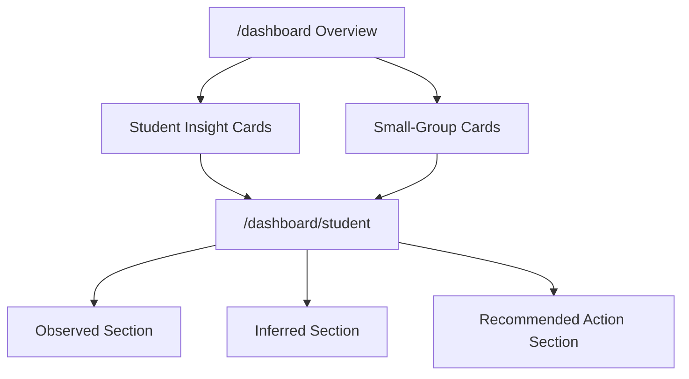

# Lane 5 Teacher Insight UI Design

Date: 2026-04-26
Status: Drafted for user review
Scope: Contest MVP+ Lane 5 teacher-facing workflow on top of merged evidence, diagnosis, and recommendation payloads

## Purpose

This design defines the UI layer for the Contest MVP+ hybrid proof after the evidence spine, runtime policy, observation/state, and diagnosis/recommendation lanes are in place. The goal is to present teacher insight as an evidence-backed workflow rather than a decorative analytics dashboard.

The design stays intentionally narrow:

- `/dashboard` is the primary entry point.
- Per-student and small-group insight surfaces share the same evidence-first hierarchy.
- `/dashboard/student` is the drill-down surface for a single learner.
- The frontend does not invent or reinterpret diagnosis semantics beyond the structured payload already produced by the backend.

## Problem Statement

The current teacher insight surface proves that the platform can emit observations and recommendations, but the teacher workflow still risks collapsing facts, diagnosis, and actions into one blended card. That weakens the thesis of the product.

For the contest MVP+, the UI should prove three claims clearly:

1. The system separates `Observed`, `Inferred`, and `Recommended Action`.
2. Teachers can scan class-level signals quickly and then drill into a student when needed.
3. Small-group suggestions are visible as actionable teaching moves rather than hidden metadata.

## Core Decision

The UI should be `Evidence-first`.

That means every primary teacher-facing insight surface follows the same order:

1. `Observed`
2. `Inferred`
3. `Recommended Action`

This is preferred over action-first or blended cards because the contest MVP still needs to earn trust. Showing the evidence before the AI interpretation makes the system easier to defend and easier to understand.

## Hero Flow

The hero flow for Lane 5 is `Overview -> detail`.

1. The teacher lands on `/dashboard`.
2. The teacher scans per-student insight cards and small-group recommendation cards.
3. The teacher selects a student to inspect more closely.
4. The teacher lands on `/dashboard/student`.
5. The teacher sees the evidence trace first, the diagnosis second, and the intervention suggestion third.

This flow balances breadth and depth. It gives the contest demo an immediately understandable overview while still proving that the system can support deeper teacher judgment.

## Information Architecture

### Dashboard Overview

The overview should contain two clearly separated sections:

1. `Student insight cards`
2. `Small-group recommendation cards`

The overview is not a generic KPI page. It is a teacher workflow page.

Each section should use the same conceptual structure but tuned to its scope.

### Student Detail

The student detail page should expand a single learner's evidence trace and recommendation context. It exists to answer:

- what actually happened;
- what the system thinks it means;
- what the teacher should do next.

## Student Insight Cards

Each student card should be easy to scan in under a few seconds. The card should expose:

- student name or identifier;
- dominant topic or misconception;
- 2-3 short observed signals such as repeated error, hint count, or confidence change;
- a diagnosis badge with confidence tag;
- a short next-action summary;
- a direct link or CTA to the student detail page.

The visual order should be:

1. `Observed`
2. `Inferred`
3. `Action`

The card must not blur evidence and diagnosis into a single paragraph.

## Small-Group Recommendation Cards

Small-group surfaces should use `grouped cards`, not tables and not inline fragments below student cards.

Each group card should show:

- the shared misconception or shared support need;
- the students in the group;
- the common evidence basis for grouping;
- the recommended teacher move for the group.

The group card should explain why the students belong together without pretending that grouping is more precise than the payload supports.

## Student Detail View

The student detail page should use an evidence-first stacked layout:

1. `Observed signals`
2. `Diagnosis`
3. `Recommended action`

The top section should show the most relevant factual trace:

- recent error patterns;
- hint or retry behavior;
- confidence or support indicators;
- any recent session summary the payload already exposes.

The diagnosis section should show:

- the primary inferred issue;
- confidence tag;
- rationale phrased as interpretation, not as fact.

The action section should show:

- what the teacher should do next;
- whether the action is individual or part of a group strategy;
- any linked follow-up path that the current UI already supports.

## Visual Semantics

The three layers need stable visual separation:

- `Observed` should look factual and neutral.
- `Inferred` should look analytical, with visible confidence framing.
- `Recommended Action` should look operational and next-step oriented.

Recommended tactics:

- use section labels directly in the UI;
- use distinct badges or tonal containers for evidence, inference, and action;
- avoid color semantics that imply a diagnosis is a hard fact;
- avoid presenting confidence as more precise than the backend payload.

## Interaction Rules

The overview should support lightweight teacher filters, limited to what the payload already supports cleanly:

- topic;
- misconception or diagnosis type;
- confidence level;
- support need.

The overview should allow a fast path into detail without modal-heavy interaction.

The student detail page should not require the teacher to reconstruct context from multiple tabs. The most important evidence and action should remain on one page.

## Mobile and Demo Constraints

The layout must remain mobile-safe and contest-demo friendly.

That means:

- prefer stacked cards over dense tables;
- keep the most important line visible without expansion;
- ensure the section order remains readable on narrow screens;
- avoid interaction patterns that rely on hover or wide-screen comparison.

## Boundaries and Non-Goals

Lane 5 owns presentation and workflow, not diagnosis semantics.

Therefore:

- do not embed diagnosis logic in the frontend;
- do not fabricate evidence summaries not present in the payload;
- do not widen backend scope unless a true payload contract gap prevents the core UX;
- if a payload gap is discovered, document the exact field or contract issue rather than silently compensating in UI code.

## Implementation Shape

Expected owned surfaces:

- `/web/app/(workspace)/dashboard/page.tsx`
- `/web/app/(workspace)/dashboard/student/page.tsx`
- `/web/components/dashboard/TeacherInsightPanel.tsx`
- additional scoped components under `/web/components/dashboard/`
- `/web/lib/dashboard-api.ts` only if presentation needs a small compatible client-side mapping

The implementation should prefer extracting focused display components over growing one large dashboard file.

## Acceptance Criteria

The design is successful when:

1. `/dashboard` clearly shows both student-level and group-level insight.
2. Every primary insight surface visibly separates `Observed`, `Inferred`, and `Recommended Action`.
3. A teacher can move from overview to student detail without losing evidence context.
4. The UI does not imply certainty beyond the confidence and evidence already in the payload.
5. The layout remains usable on both desktop and mobile.

## Risks

### Risk 1: Payload shape is too thin for the intended detail page

Mitigation:
- keep the first pass conservative;
- surface only the evidence already available;
- escalate a precise contract gap to the human if required.

### Risk 2: Cards become visually dense

Mitigation:
- constrain each card to a short evidence summary;
- move longer rationale or traces into the detail view.

### Risk 3: UI appears smarter than the backend really is

Mitigation:
- preserve evidence-first ordering;
- label diagnosis as interpretation;
- show confidence and action as bounded suggestions, not absolute truth.

## Architecture Note

This lane changes the teacher workflow surface, but not the underlying diagnosis engine. The frontend reflects the pipeline boundaries rather than redefining them.
