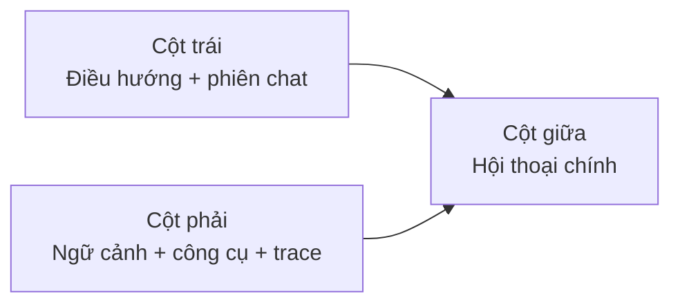

# Playground Chat Workspace Design

Date: 2026-04-30  
Repository: `Creative-Science-Contest-2026/Multiagent-learning-platform`  
Design status: Approved by project owner in brainstorming session

## 1. Purpose

The current `Playground` route still reads like a capability demo: a centered card, small content regions, and mixed product language. That shape does not support the contest-facing impression the product now needs. The route should instead feel like the primary AI workspace: large conversation canvas, strong information hierarchy, and controls that stay available without crowding the main chat.

The design goal is to replace the current `Playground` UI with a full-screen, three-column conversational shell that borrows the strongest interaction cues from OpenAI-style chat workspaces and VS Code-style resizable side panels while staying inside the current Next.js workspace structure.

## 2. Problem

The current route has four visible weaknesses:

1. it uses a centered card layout instead of a full-screen workspace shell
2. capability selection is overemphasized while actual conversation space is too small
3. side controls consume attention through text-heavy cards instead of icon-first utility patterns
4. several directly visible strings still appear in English or mixed English-Vietnamese copy

These issues reduce perceived product maturity even though the underlying chat/runtime flow already exists.

## 3. Scope

In scope:

- `web/app/(workspace)/playground/page.tsx`
- directly reused chat presentation components in `web/components/chat/home/`
- session list rendering for the new left rail
- sidebar/navigation copy and icon-only affordances if needed
- Vietnamese-first user-facing strings on the touched surface
- focused frontend regression tests for copy and navigation

Out of scope:

- backend capability execution logic
- dashboard, guide, marketplace, agents, or utility route redesigns
- a global design-system rewrite
- new persistence models for sessions or tools

## 4. Selected Approach

Use the existing route and current playground/chat data seams, but replace the route composition with a chat-first shell. Reuse current streaming/session/config logic instead of inventing a new runtime path.

This approach is preferred because it gives a decisive UI reset without duplicating capability behavior or forking chat state into a second implementation path.

## 5. Layout Architecture

The route becomes a three-column grid that consumes the full workspace viewport height.

### Left Column

The left column combines navigation and conversation history in one shell:

- product mark and route title
- action to create a new conversation
- optional compact navigation shortcuts
- session history grouped by recency
- collapse control to switch between expanded rail and icon-led narrow rail

The column should feel denser than the current sidebar but still readable. Session titles remain visible in expanded mode and condense to tighter affordances in collapsed mode.

### Center Column

The center column is the primary canvas and must dominate the screen:

- large conversation scroll area
- bigger message bubbles and wider readable line lengths
- full-height message region with better whitespace hierarchy
- prominent composer docked at the bottom
- support for attachments and mode-specific config without pushing the message area into a small card

This column should no longer sit inside a bordered demo card. It should read as the main working surface.

### Right Column

The right column is a context and control panel:

- selected capability summary
- enabled tools and quick toggles
- knowledge-base selector
- contextual trace/process output
- mode-specific controls for research, quiz generation, or other supported capability variants

This panel should be collapsible and visually secondary to the center canvas. It behaves like an inspector panel rather than a second main page.

## 6. Interaction Model

### Panel controls

- left and right panels each need a collapse/expand affordance
- icon-only controls must expose Vietnamese tooltip or accessible labels
- the page should preserve usable behavior when one or both side panels are collapsed

### Chat flow

- creating a new chat should remain fast and obvious
- selecting a session should update the center conversation and right context panel
- streaming assistant output continues using the existing event model
- the center pane should stay visually stable while tools/config are adjusted on the side

### Capability and tool controls

The current capability/tool logic remains, but the presentation shifts:

- capability selection should become a compact contextual control instead of a full card list
- tool toggles should appear as chips, icon rows, or compact cards inside the right panel
- mode-specific forms remain available, but only when the selected capability requires them

## 7. Vietnamese-first Copy Strategy

The route should present Vietnamese-first UI text across:

- titles, section labels, button labels, placeholders
- session grouping labels where directly rendered on this surface
- tooltip text and `aria-label` values for icon-only controls

English can remain in untouched areas outside scope, but the refreshed `Playground` experience itself should no longer expose obvious English labels like `Playground`, `Capabilities`, `Tools`, `Chat`, `Untitled chat`, `Today`, or `Yesterday`.

## 8. Component Strategy

### Route-level restructuring

`web/app/(workspace)/playground/page.tsx` should become the orchestrator of:

- panel collapse state
- selected session and message stream state
- capability and tool state
- responsive shell composition

If the file becomes too large, extract presentational sections into narrowly-scoped workspace chat subcomponents rather than adding more inline JSX.

### Session list refresh

`web/components/SessionList.tsx` already owns grouping and rename/delete affordances. Keep its data contract, but refresh its presentation so it can work as the left workspace rail:

- larger active state
- denser secondary metadata
- Vietnamese recency labels
- better compact/collapsed behavior

### Chat presentation refresh

`ChatMessages.tsx` and `ChatComposer.tsx` should preserve current behavior but change presentation:

- larger visual scale
- cleaner chrome
- more decisive hierarchy between user and assistant messages
- icon-first actions with Vietnamese accessible labels

### Trace and context

Trace/process surfaces should remain available but be routed into the right panel or inline panel sections instead of appearing as the dominant top-level structure.

## 9. Candidate Implementation Approaches

### Option A: Restyle the existing card layout

Pros:

- smallest diff
- lower immediate risk

Cons:

- likely still feels like a demo tool
- harder to achieve a strong shell identity

### Option B: Recompose the route into a shell using existing chat/session pieces

Pros:

- best balance between speed and product impact
- preserves current runtime behavior
- avoids duplicating chat logic

Cons:

- requires coordinated edits across several UI components

### Option C: Build an almost separate playground-only chat UI

Pros:

- maximum layout freedom

Cons:

- duplicates interaction logic
- higher regression risk
- unnecessary maintenance cost

## 10. Chosen Implementation Direction

Choose option B.

The route should become a true workspace shell, but keep the existing state and backend seams. This is the cleanest way to make the UI feel product-grade without widening scope into a parallel chat stack.

## 11. Tests And Validation

### Automated

- focused frontend tests covering Vietnamese copy expectations on touched shared labels
- sidebar/navigation test coverage if labels or group structure changes
- targeted route/build validation for the touched files

### Manual

- verify full-height desktop layout
- verify left and right panel collapse/expand behavior
- verify a new chat can be created and messages stream normally
- verify icon-only controls remain understandable through tooltip or accessible labels
- verify visible route copy is Vietnamese-first

## 12. Risks

- `playground/page.tsx` is already large and may become harder to maintain if the shell is implemented inline
- reusing chat components may expose English copy in deeper shared UI than initially expected
- moving trace/config elements into the right panel can accidentally hide required controls if conditional rendering is too aggressive

## 13. Mitigations

- extract new presentational subcomponents when the route-level file stops being legible
- audit touched copy from `SessionList`, composer, and page-level sections as one set
- keep the right panel state simple and default-visible until the collapsed UX is validated

## 14. Acceptance Snapshot

The design is successful when `/playground` feels like a primary chat workspace instead of a technical lab:

- three-column full-screen shell
- dominant center conversation canvas
- collapsible side panels
- icon-first actions with Vietnamese help text
- Vietnamese-first visible copy
- no regression in current chat/session streaming behavior
