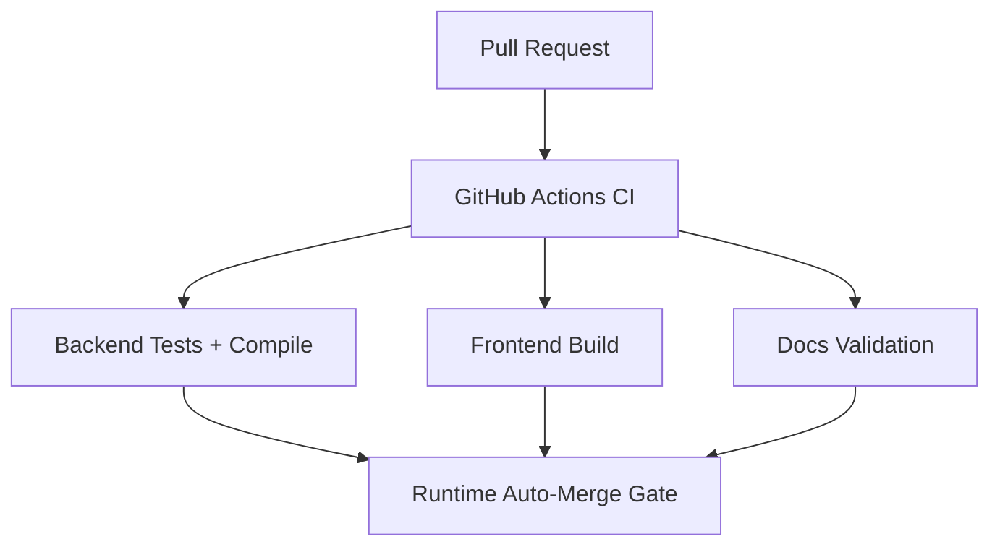

# Feature Pod Task: Backend and Frontend CI Checks

Owner: CI / Workflow AI worker
Branch: `docs/ci-backend-frontend-checks` for packet; implementation branch should be `fix/ci-backend-frontend-checks`
GitHub Issue: `#16`

## Goal

Add reliable automated checks so runtime/product PRs can be auto-merged only after backend and frontend validation pass.

## User-visible outcome

The GitHub PR page shows CI status for core backend tests, frontend build, and docs validation. AI workers can use those checks as merge gates instead of relying only on local validation.

## Owned files/modules

- `.github/workflows/`
- `docs/superpowers/pr-notes/ci-backend-frontend-checks.md`
- `ai_first/daily/YYYY-MM-DD.md`
- `ai_first/CURRENT_STATE.md`
- `ai_first/NEXT_ACTIONS.md`
- `ai_first/AI_OPERATING_PROMPT.md` if merge policy or next actions change

## Do-not-touch files/modules

- `deeptutor/` product/runtime code
- `web/` product/runtime code
- `data/`
- `.env*`
- `package-lock.json`
- `docs/package-lock.json`
- `web/package-lock.json`
- requirements files, unless CI dependency installation proves they are missing or inconsistent

## CI contract

Create one focused GitHub Actions workflow that runs on pull requests and pushes to `main`.

Required jobs:

- Backend:
  - set up Python 3.12;
  - install project with server/test dependencies using the existing repo dependency files or `pyproject.toml`;
  - run:
    - `pytest tests/api/test_knowledge_router.py -v`
    - `pytest tests/knowledge -v`
    - `pytest tests/api/test_question_router.py -v`
    - `pytest tests/api/test_unified_ws_turn_runtime.py -v`
    - `pytest tests/api/test_dashboard_router.py -v`
    - `pytest tests/services/session -v`
    - `python -m compileall deeptutor`
- Frontend:
  - set up Node using the version compatible with the current Next.js project;
  - run `npm ci` in `web/`;
  - run `npm run build` in `web/` with `NEXT_PUBLIC_API_BASE=http://localhost:8001`.
- Docs:
  - run `git diff --check`;
  - run `rg -n "Mermaid|PR Architecture Note|Main System Map" docs/superpowers/pr-notes ai_first docs/contest`.

## Acceptance criteria

- A PR against `main` triggers backend, frontend, and docs checks.
- Workflow names are readable from the PR checks list.
- CI does not require real LLM credentials.
- CI does not modify lockfiles.
- If dependency installation fails, diagnose from logs and update only the narrow dependency setup needed.
- The PR includes an architecture note with Mermaid.
- `ai_first/AI_OPERATING_PROMPT.md` is updated only if CI check names or merge gates become authoritative.

## Required local validation before PR

- `git diff --check`
- `rg -n "backend|frontend|pytest|npm run build|NEXT_PUBLIC_API_BASE|Mermaid" .github/workflows docs/superpowers/pr-notes ai_first`

If local GitHub Actions emulation is available, optionally run the workflow with `act`, but do not make `act` a required dependency.

## Manual verification

- Open the PR checks list after pushing.
- Confirm each job starts and reports a clear status.
- If checks fail because of missing CI dependencies, fix that PR before starting another feature.
- If checks pass, update `ai_first/NEXT_ACTIONS.md` to treat CI failures as the highest-priority next task.

## Mermaid Diagram

## PR architecture note

- Must include Mermaid diagram.
- Must state whether `ai_first/architecture/MAIN_SYSTEM_MAP.md` changed. It should not be needed unless the workflow is added to the architecture map.

## Handoff notes

- Start with a minimal workflow; do not add matrix builds until the single reliable lane is green.
- Keep docs-only and runtime/product changes separated.
- Do not broaden this into deployment, secrets management, or release automation.
