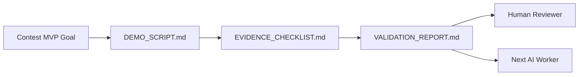

# Feature Pod Task: Contest Evidence and Demo Bundle

Owner: Documentation / Evidence AI worker
Branch: `docs/contest-evidence-demo`
GitHub Issue: `#12`

## Goal

Prepare the contest evidence bundle that proves the MVP path works end to end:

Teacher creates Knowledge Pack -> AI generates assessment -> Student learns with Tutor Agent -> Teacher sees dashboard.

## User-visible outcome

A human reviewer can open the repo docs and follow a clear demo script, evidence checklist, and validation report without asking the AI what was done or how to verify it.

## Owned files/modules

- `docs/contest/`
- `docs/superpowers/pr-notes/contest-evidence-demo.md`
- `ai_first/daily/YYYY-MM-DD.md`
- `ai_first/CURRENT_STATE.md`
- `ai_first/NEXT_ACTIONS.md`
- `ai_first/AI_OPERATING_PROMPT.md` if the operating queue changes

## Do-not-touch files/modules

- `deeptutor/`
- `web/`
- `requirements/`
- `package-lock.json`
- `docs/package-lock.json`
- `web/package-lock.json`
- `.env*`
- `data/`

## Evidence contract

Create a compact `docs/contest/` evidence set with:

- `DEMO_SCRIPT.md`: a step-by-step demo path for Knowledge Pack, assessment generation, student tutoring, and teacher dashboard review.
- `EVIDENCE_CHECKLIST.md`: required screenshots, optional video capture, expected commands, and pass/fail evidence fields.
- `VALIDATION_REPORT.md`: exact local validation commands, current known limitations, and manual verification results.
- `README.md`: one-page entry point linking the evidence files and explaining how to update them after product changes.

The docs should make clear which evidence is already validated locally and which evidence needs human capture, such as screenshots or video.

## Acceptance criteria

- `docs/contest/README.md` is the entry point for contest evidence.
- The demo script covers the full MVP path in the product goal order.
- The checklist separates required evidence from optional polish.
- The validation report includes exact commands and a place to record results.
- The task stays docs-only and does not modify product/runtime code.
- The PR includes an architecture note with Mermaid.

## Required validation

- `rg -n "Knowledge Pack|assessment|Tutor|Dashboard|Mermaid|validation|screenshot|video" docs/contest docs/superpowers/pr-notes`
- `git diff --check`

## Manual verification

- Read `docs/contest/README.md` first.
- Follow links to the demo script, checklist, and validation report.
- Confirm a new AI worker can tell what evidence to capture next without reading old chat history.

## Mermaid Diagram

## PR architecture note

- Must include Mermaid diagram.
- State that `ai_first/architecture/MAIN_SYSTEM_MAP.md` is not updated because this packet creates documentation work, not a product architecture change.

## Handoff notes

- After this task packet PR merges, execute this packet before starting another product feature.
- Keep screenshots and video assets small or link to externally hosted captures if repository size becomes a concern.
- Do not add secrets, local user paths, real student data, or private credentials to evidence docs.
