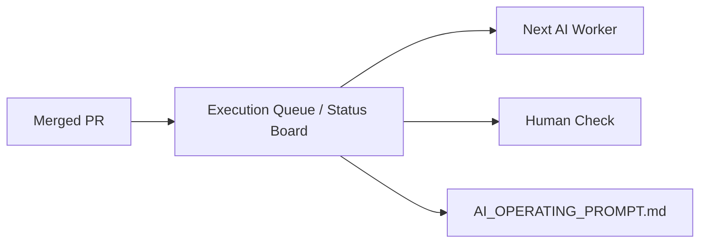

# Feature Pod Task: Execution Queue and Status Board

Owner: Documentation / Workflow AI worker
Branch: `docs/execution-queue-status-board`
GitHub Issue: `#19`

## Goal

Add one compact, human-readable execution queue and status board so AI workers can keep the next task, latest merge result, and active blockers in one place after each PR lands.

## User-visible outcome

A human can open one Markdown file and quickly see:

- what merged most recently;
- which issues or PRs are still active;
- what the AI should do next;
- whether any blocker needs human judgment.

## Owned files/modules

- `ai_first/`
- `docs/superpowers/pr-notes/execution-queue-status-board.md`
- `docs/superpowers/tasks/2026-04-19-execution-queue-status-board.md`

## Do-not-touch files/modules

- `deeptutor/`
- `web/`
- `requirements/`
- `.github/workflows/`
- `package-lock.json`
- `docs/package-lock.json`
- `web/package-lock.json`
- `.env*`
- `data/`

## Queue contract

Create or update a compact queue/status document under `ai_first/` that:

- names the latest merged PR or milestone update;
- lists active issues or PRs still relevant to execution;
- states the next recommended task in one short section;
- separates blockers that need human review from blockers AI should resolve itself;
- points back to `AI_OPERATING_PROMPT.md` as the authoritative control plane.

The document must stay short enough that a new AI worker or a human can read it in under two minutes.

## Acceptance criteria

- There is one obvious Markdown entry point for execution status and next-task selection.
- The status board does not duplicate the full operating prompt.
- The queue stays consistent with open GitHub issues and active task packets.
- The PR includes an architecture note with Mermaid.
- The change stays docs/workflow-only.

## Required validation

- `rg -n "execution queue|status board|next task|blocker|GitHub Issue|Mermaid" ai_first docs/superpowers/tasks docs/superpowers/pr-notes`
- `git diff --check`

## Manual verification

- Open the status board first without reading old chat history.
- Confirm a new AI worker can identify the current next task in under two minutes.
- Confirm the board points to the authoritative operating prompt for full rules.

## Mermaid Diagram

## PR architecture note

- Must include Mermaid diagram.
- State that `ai_first/architecture/MAIN_SYSTEM_MAP.md` does not need an update because this packet adds queue/reporting docs, not a product architecture change.

## Handoff notes

- Keep this packet small and operational.
- Do not invent a second control plane.
- Prefer updating or adding one compact status document over spreading queue state across many files.
